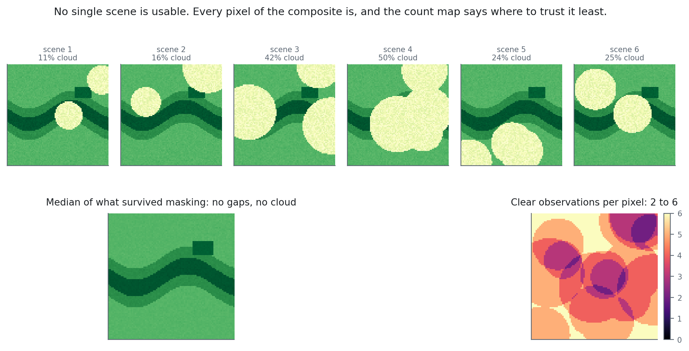

# Cloud Masking and Composites {#sec-cloud}

::: {.chapter-goal}
#### In this chapter
You will delete cloud pixel by pixel rather than scene by scene, and reduce a full year of contaminated imagery into one clean composite. This is the chapter that makes tropical remote sensing possible at all.
:::

## The tropical problem

Over much of the humid tropics, a fully clear Sentinel-2 scene may not exist in a given year. Cloud cover over equatorial Indonesia, the Congo basin and the Amazon frequently exceeds 70 percent on an annual average, and the coastal zones where mangroves grow are among the cloudiest parts of those regions because of the convection that sea breezes drive.

If your method requires a clear scene, your method does not work here. The way forward is to stop looking for good images and start assembling good pixels.

The insight is that cloud moves. A pixel obscured on 3 March may be clear on 18 March, and a pixel obscured on 18 March may have been clear on the 3rd. Take every acquisition in a year, delete the contaminated pixels from each, and take the median of whatever survives at each location. The output has no gaps even though no input was gap free, and it is assembled from whichever dates happened to be clear at each point.

::: {.callout-note}
## Concept: why the median and not the mean
Both ignore masked pixels. The difference is what happens to contamination that survives masking, and some always does, particularly thin cirrus and cloud edge haze. Those survivors are bright, and they pull a mean upwards. A median is insensitive to them unless they outnumber the clear observations. The rule of thumb: use the median unless you have a specific reason not to, and if you have fewer than about ten clear observations at a pixel, treat that pixel's value with suspicion.
:::

## Two routes to a cloud mask

Sentinel-2 offers two masking approaches, and the difference matters.

**The QA60 bitmask** is the older method. It packs cloud flags into individual bits of a 60 metre resolution band, which means decoding with bitwise operations:

```javascript
// Bit 10 is opaque cloud, bit 11 is cirrus. Both must be zero to keep a pixel.
var qa = image.select('QA60');
var cloudBit = 1 << 10;
var cirrusBit = 1 << 11;
var mask = qa.bitwiseAnd(cloudBit).eq(0)
  .and(qa.bitwiseAnd(cirrusBit).eq(0));
```

It is fast, and it is what most older tutorials show. Its weaknesses are real: 60 metre resolution means the mask is coarser than the imagery it masks, and it does not flag cloud shadow at all. Over a mangrove delta, unmasked shadow reads as dark water and will be classified as such.

**The Scene Classification Layer**, SCL, is the current method for Level-2A data. Sen2Cor assigns every 20 metre pixel to one of twelve classes, including cloud shadow, which makes the test readable rather than bitwise. This book uses SCL throughout.

::: {.callout-warning}
## Common failure: QA60 on recent imagery
The QA60 band was deprecated and stopped being populated for scenes processed after early 2022. A script using it on recent data will run without error and mask nothing, because every bit reads as zero. The composite will look plausible and be full of cloud. If you inherit a script that uses QA60, check the acquisition dates before trusting the output.
:::

{#fig-compositing}

Look at the bottom right panel. Clear observations per pixel run from 2 to 6. A pixel built from two observations is not wrong, but it carries far less confidence than its neighbour built from six, and that difference is invisible in the composite itself.

## The full workflow



## Anatomy of the mask

The masking logic deserves a close read, because the pattern recurs throughout the book.

```javascript
var clear = scl.neq(3)      // <1>
  .and(scl.neq(8))          // <2>
  .and(scl.neq(9))          // <2>
  .and(scl.neq(10))         // <3>
  .and(scl.neq(11));        // <4>

return image.updateMask(clear);   // <5>
```
1. Cloud shadow. Frequently the most damaging omission, because shadow over water is nearly indistinguishable from deep water and will corrupt any water index.
2. Medium and high probability cloud. Excluding only high probability leaves a halo of semi transparent cloud around every masked area.
3. Thin cirrus. Barely visible to the eye and severely distorting to shortwave infrared bands, which is where mangrove discrimination lives.
4. Snow and ice. Physically absent in the tropics, but Sen2Cor mislabels bright sand, surf and cloud edges into this class often enough to justify keeping the test.
5. `updateMask` marks failing pixels as no data rather than setting them to zero. This is the critical difference: a zero would be included in the median and drag it down, while a masked pixel is skipped entirely.

## Composite choices

`median()` is the default recommendation, but three alternatives are worth knowing because each answers a different question.

**`mosaic()`** takes the last valid observation at each pixel. It is fast and preserves genuine spectral values rather than synthesising a statistic. It also produces visible seams where adjacent regions came from different dates, which makes it poor for quantitative work and acceptable for a quick look.

**`qualityMosaic('NDVI')`** selects, at each pixel, the observation with the highest NDVI. The result is a peak greenness composite, which is standard practice in agricultural monitoring where you want the crop at maximum development. It biases systematically towards the wettest dates, so a peak greenness composite is not a fair summary of average condition.

**`.reduce(ee.Reducer.percentile([25]))`** produces a darker composite. Because residual haze is bright, the lower quartile is often cleaner than the median in very cloudy regions, at the cost of biasing values downwards.

::: {.callout-important}
## Scientific integrity: a composite is not an observation
An annual median composite is a statistical construction. No satellite ever recorded that image. This has three consequences for how results should be reported. Phenology is erased, so a composite cannot support any claim about seasonal condition. The effective date is the middle of the compositing window, not a single acquisition, and should be described that way. And pixels differ in how many clear observations contributed to them, so confidence is not spatially uniform. Where it matters, compute and report the observation count:

```javascript
var observationCount = processed.select('B8').count().rename('n_clear');
```
:::

## How many scenes does a clear pixel need?

The argument for compositing is usually made qualitatively: it is cloudy, so stack more images. The quantitative version is more useful, because it tells you when to stop and when to give up on optical data altogether.

Treat each acquisition as an independent coin flip with probability $p$ of that pixel being cloudy. The chance that at least one of $n$ scenes sees it clear is $1 - p^{n}$. That expression, plotted below, is the whole case for compositing.

```{python}
#| label: fig-clear-probability
#| fig-cap: "Probability that a pixel is seen clear at least once, against the number of acquisitions in the window. Hover for exact values. The dashed line is the point where one pixel in twenty is still missing after the whole window."
import numpy as np
import plotly.graph_objects as go
import booklib as bk

scenes = np.arange(1, 61)
fig = go.Figure()

for cloud in [0.5, 0.7, 0.85, 0.95]:
    fig.add_scatter(
        x=scenes,
        y=[bk.clear_probability(cloud, n) for n in scenes],
        mode="lines",
        name=f"{cloud:.0%} cloudy",
        hovertemplate="%{y:.1%} clear after %{x} scenes<extra>"
                      + f"{cloud:.0%} cloudy</extra>",
    )

fig.add_hline(y=0.95, line_dash="dash", line_color=bk.MUTED,
              annotation_text="95%", annotation_position="bottom right")
fig.update_xaxes(title="Acquisitions in the compositing window")
fig.update_yaxes(title="P(at least one clear view)", tickformat=".0%", range=[0, 1.02])
bk.show(fig, height=380)
```

Read the 95 percent line. At fifty percent cloud, five scenes are enough, which is a fortnight of Sentinel-2. At eighty five percent cloud you need about nineteen, which is roughly a quarter. At ninety five percent, you need nearly sixty, which is more acquisitions than a single Sentinel-2 orbit delivers in a year over much of the equatorial belt.

```{python}
#| label: tbl-clear-scenes
import pandas as pd
import booklib as bk

rows = []
for cloud in [0.3, 0.5, 0.7, 0.85, 0.9, 0.95]:
    need = next(n for n in range(1, 400) if bk.clear_probability(cloud, n) >= 0.95)
    rows.append({
        "Cloud probability": f"{cloud:.0%}",
        "Scenes for 95% coverage": need,
        "Sentinel-2 days at 5 day revisit": need * 5,
        "Clear after one year (73 scenes)": bk.clear_probability(cloud, 73),
    })

bk.table(pd.DataFrame(rows), caption=(
    "Independence is assumed throughout, which makes every figure here "
    "optimistic. Cloud is seasonal and spatially organised, so a monsoon "
    "month behaves far worse than the arithmetic suggests."
))
```

That last column is the one to take seriously, and to distrust. It says a full year clears even a 95 percent cloudy pixel with near certainty. Real composites over Papua and Kalimantan do not behave that way, and the reason is in the assumption rather than in the arithmetic: cloud is not an independent coin flip. It arrives in wet seasons that last months and sits over the same ridges every afternoon. A pixel under a persistent orographic cloud is not cloudy 95 percent of the time at random; it is cloudy almost every afternoon the satellite passes.

::: {.callout-important}
## The assumption is the lesson
When your composite has holes and this arithmetic says it should not, the arithmetic is not wrong. Independence was. That is the point at which radar stops being an advanced topic and becomes the only option, which is Chapter 10.
:::

### The same arithmetic as a map

A curve says 95 percent of pixels are covered. It does not say where the other five percent are, and that is the question a reviewer asks. Each square below is a pixel.




### Run it yourself

::: {.py-live}
```python
def clear_probability(cloud, n):
    """Chance of at least one clear view in n scenes, if cloud were random."""
    return 1 - cloud ** n

def scenes_needed(cloud, target=0.95):
    n = 1
    while clear_probability(cloud, n) < target and n < 1000:
        n += 1
    return n

for cloud in [0.3, 0.6, 0.8, 0.9]:
    n = scenes_needed(cloud)
    print(f"{cloud:.0%} cloudy -> {n:3d} scenes for 95% coverage"
          f"  ({n * 5:4d} days at Sentinel-2 revisit)")

# Your own site: put in the cloud fraction your metadata query reports
# and the length of your window in days.
cloud, window_days = 0.82, 365
scenes = window_days / 5
print(f"\n{window_days} days, {cloud:.0%} cloudy, {scenes:.0f} scenes"
      f" -> {clear_probability(cloud, scenes):.1%} of pixels seen clear")
```
:::


## When compositing is not enough

In the very cloudiest places, chronically clouded mountain valleys, some equatorial coasts in the wettest years, even a full year of optical data leaves gaps. Two responses exist.

Widen the window: a two or three year composite fills the holes at the cost of temporal precision, and it becomes indefensible in a change detection study where the whole point is knowing when something happened.

Or change sensor. Radar sees through cloud entirely, because microwaves at Sentinel-1 wavelengths are unaffected by water droplets. That is Chapter 10.


<script type="application/json" class="lms-quiz">
{
  "id": "ch09-compositing",
  "questions": [
    {
      "q": "Why does this chapter use updateMask rather than setting cloudy pixels to zero?",
      "options": [
        "It is faster",
        "A masked pixel is skipped by the reducer, whereas a zero would be included and drag the median down",
        "Zero is not a valid reflectance value",
        "updateMask preserves the band names"
      ],
      "answer": 1,
      "why": "This is the mechanical heart of compositing. No data and zero behave completely differently under a reducer, and confusing them produces a composite that is quietly too dark."
    },
    {
      "q": "A script inherited from 2021 uses the QA60 band for cloud masking and is run on 2024 imagery. What happens?",
      "options": [
        "It throws a clear error about a missing band",
        "It runs without error and masks nothing, because QA60 stopped being populated",
        "It masks too aggressively and removes clear pixels",
        "It automatically falls back to the SCL band"
      ],
      "answer": 1,
      "why": "Silent failure is the dangerous kind. The composite looks plausible and is full of cloud, and nothing in the output signals a problem."
    },
    {
      "q": "Why does the compositing script deliberately omit a scene level cloud percentage filter?",
      "options": [
        "Because the filter is deprecated",
        "Because discarding an 80 percent cloudy scene also discards the 20 percent that was clear over your site",
        "Because it slows the computation down",
        "Because median compositing already removes whole scenes"
      ],
      "answer": 1,
      "why": "Scene level cloud is a blunt instrument over a small study area. Per pixel masking keeps the usable fifth of a mostly cloudy scene."
    }
  ]
}
</script>

## Exercises {.unnumbered}

1. Build the composite with and without `updateMask`. Zoom to a river mouth and describe the difference in one paragraph.
2. Add an observation count band and map it. Identify the parts of your study area where fewer than ten clear observations contributed, and consider what that means for any classification built there.
3. Build a wet season composite and a dry season composite separately. Difference their NDWI bands and interpret the result.
4. Replace `median()` with `qualityMosaic('NDVI')` and compare mangrove edges between the two. Which would you submit with a monitoring report, and what would you say in the methods section?
