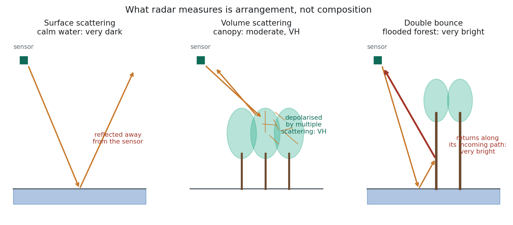
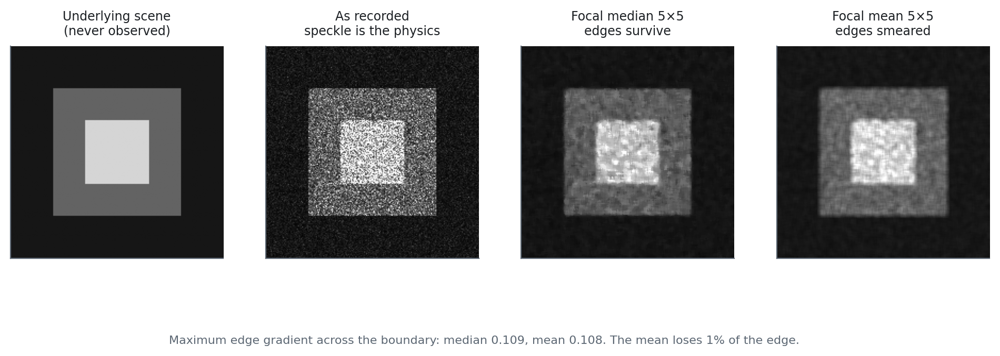

# Synthetic Aperture Radar Fusion {#sec-sar}

::: {.chapter-goal}
#### In this chapter
You will add a sensor that ignores cloud entirely, understand what radar is physically measuring and why it is not a substitute for optical data, and fuse C band and L band backscatter with your optical stack into one analysis ready image.
:::

## The sensor that does not need the sun

Everything in Chapters 8 and 9 depended on reflected sunlight. That makes optical sensors blind at night and blind through cloud, and Chapter 9 spent its length working around the second limitation.

Radar removes the limitation rather than working around it. Sentinel-1 emits its own microwave pulse and measures what comes back. Microwaves at these wavelengths pass through cloud with negligible loss, so a Sentinel-1 acquisition over the Mahakam Delta in February is exactly as usable as one in August.

That sounds like it should end the chapter. It does not, because radar is not a cloud proof camera. It measures something different.

## What backscatter actually responds to

{#fig-scattering}

Optical sensors measure **composition**: what a surface is made of, through the pigments and water that absorb at particular wavelengths. Radar measures **structure**: how a surface is arranged in three dimensions.

Three properties govern what returns.

**Roughness relative to the wavelength.** A surface smooth at the scale of the wavelength reflects the pulse away from the sensor like a mirror. Calm water is the extreme case and appears almost black. A rough surface scatters in all directions, some of it back, and appears bright.

**Geometry.** Vertical structures standing on a horizontal surface produce a **double bounce**: the pulse hits the water, reflects to the trunk, and returns along its incoming path. This is very bright, and it is characteristic of flooded forest, which is what a mangrove is at high tide. No terrestrial forest produces it.

**Moisture.** Water raises the dielectric constant of a material, increasing backscatter. Wet soil is brighter than dry soil, and the same ground can differ by several decibels between wet and dry season.

::: {.callout-note}
## Concept: polarisation carries different information
Sentinel-1 transmits vertically and receives in two configurations.

**VV**, vertical out and vertical back, responds mainly to surface scattering. Good for water extent, bare ground and flooding.

**VH**, vertical out and horizontal back, only returns energy that has been *depolarised*, which requires multiple scattering inside a volume. That volume is the canopy. VH is therefore the structure channel, and the one that correlates with biomass.

Using both is not redundancy. A flooded bare mudflat and a flooded forest look similar in VV and very different in VH.
:::

## Two wavelengths, two depths

Sentinel-1 is **C band**, about 5.6 cm. Those waves interact with leaves and small branches, so C band senses the upper canopy.

ALOS PALSAR is **L band**, about 23 cm. Longer waves pass through foliage and interact with trunks and large branches. L band reaches further into and through the canopy, correlates better with total above ground biomass, and saturates less readily in dense forest.

For mangroves the implication is direct. C band reports canopy condition; L band reports structure and biomass. Chapter 20 needs the second when it turns maps into carbon numbers.

## Speckle, and why it is not noise in the usual sense

Radar imagery has a grainy, salt and pepper quality that looks like sensor noise and is not. It is **speckle**, and it is inherent to coherent imaging.

Each resolution cell contains many individual scatterers. The returns from them arrive with different phases and interfere, constructively in some cells and destructively in others. The result is a multiplicative fluctuation that no better sensor could remove, because it is a property of the physics rather than a defect in the instrument.

It has to be filtered, and the filter choice is a trade between smoothness and edges.

| Filter | Behaviour |
|---|---|
| Focal mean | Smoothest result, destroys edges. Avoid on anything with boundaries you care about. |
| Focal median | Good speckle suppression, preserves edges reasonably. The default in this book. |
| Lee | Adapts to local variance, better edge preservation, more computation. |
| Refined Lee | Best edge preservation, considerably more complex to implement in Earth Engine. |

Specify the window in **metres**, not pixels, so the filter behaves the same regardless of the scale a later computation runs at.

::: {.callout-warning}
## Common failure: mixing orbit directions
Sentinel-1 passes over on ascending and descending orbits, viewing the same terrain from opposite sides. In flat coastal terrain the difference is small. Anywhere with relief it is large, because slopes facing the sensor are bright and slopes facing away are dark.

Compositing both directions together adds a geometric signal that has nothing to do with the ground and everything to do with which day the satellite happened to pass. Filter on `orbitProperties_pass` to a single direction, and say which one in your methods.
:::

{#fig-speckle}

The figure quantifies the trade rather than asserting it. Read the caption under the panels for the measured edge gradient.

## The full workflow

The script below is the one every later chapter depends on. It is written as `getAnalysisReadyData(year)` rather than as a linear script, and that single change is what turns a one off map into a monitoring system: Chapter 21 calls it in a loop to build a time series, Chapter 16 calls it once to train a classifier, and neither needs to know how it works.



## The conversion nobody mentions

One block in that script deserves attention because skipping it is common and the consequences are invisible.

ALOS PALSAR ships **digital numbers**, not physical backscatter. The published conversion is:

$$\gamma^0_{dB} = 10 \log_{10}(DN^2) - 83.0$$

Without it, PALSAR bands sit on a completely different numeric scale from the 0 to 1 reflectance bands beside them. Random Forest tolerates that, because trees split on thresholds and do not care about magnitude. A support vector machine does not, because it computes distances, and a band with a range in the thousands drowns out every band with a range of one.

So an unconverted stack produces a Random Forest that works and an SVM that mysteriously performs badly, which is a difficult symptom to trace back to a missing constant.

::: {.callout-important}
## Scientific integrity: state the speckle filter
Speckle filtering changes pixel values, and different filters change them differently. Two studies reporting different mangrove biomass for the same site have sometimes differed by nothing more than one using a 3 by 3 mean and the other a 50 m median. Name the filter and the window size alongside the scale and the compositing method.
:::

## When fusion is worth it, and when it is not

Adding radar to an optical stack nearly always improves accuracy and always increases complexity. The judgement is whether the improvement addresses the error that is actually limiting you.

For mangrove mapping it clearly does. The confusion capping accuracy is with other dense broadleaf forest, and optical data cannot resolve it because the two are spectrally alike. Radar separates them physically: mangrove standing in water produces double bounce, terrestrial forest does not.

For a broad forest and non forest map, it usually does not. Optical data already separates those classes cleanly, and the radar bands add computation, a maintenance burden and another failure mode for perhaps half an accuracy point.

The test from Chapter 3 applies: run the classification on optical alone, read the confusion matrix, identify the specific class pair that is failing, and add the one data source that addresses that pair. Adding everything at once and observing that accuracy rose three points teaches you nothing about why.

## Exercises {.unnumbered}

1. Toggle between the optical composite and the VH layer over a stand of mangrove at high tide. Find the double bounce signature.
2. Remove `.divide(10000)` from the cloud masking function and rerun. The map looks almost unchanged and every index is wrong. Explain why.
3. Call `getAnalysisReadyData` for 2019 and check the Console for which PALSAR epoch the fallback selected.
4. Composite ascending and descending Sentinel-1 orbits separately and difference them. Over flat delta, over nearby hills. Where is the difference large, and why?
