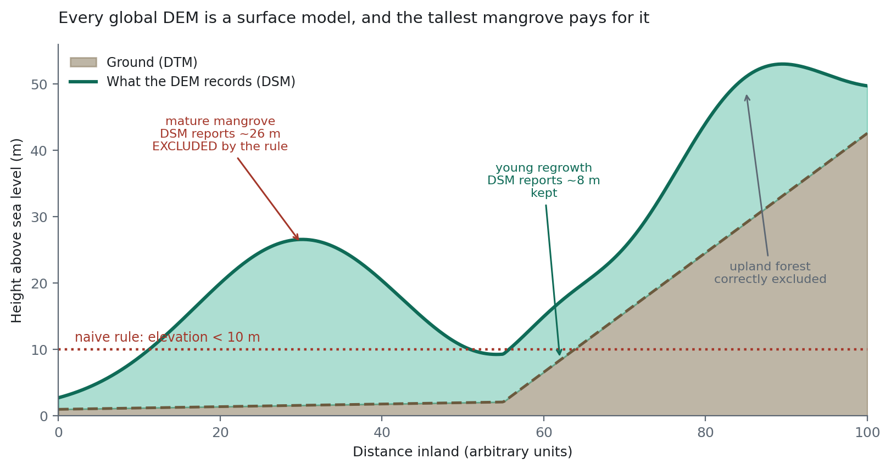

# Terrain and Hydrological Context {#sec-terrain}

::: {.chapter-goal}
#### In this chapter
You will add the cheapest accuracy gain available in this book. Elevation is free, global, already in the catalogue, and it fixes the specific failure that caps mangrove mapping: forest on a hillside being classified as forest in a tidal zone.
:::

## The error this chapter exists to fix

A mangrove classification trained on spectral data alone will, reliably, put mangrove on a hillside twenty metres above the tide line.

It is not a bug in the classifier. Mangrove and upland broadleaf forest have nearly identical spectral signatures, so from reflectance alone the classifier is making a defensible call. What separates them is not what they are made of but **where they can be**: mangroves occupy the intertidal band, a few metres above sea level, and nothing else about them is as reliably distinctive.

Elevation encodes that rule in a form a model can learn. Adding it is a few lines and it removes an entire class of error.

## Choosing a DEM

| Dataset | Resolution | Acquired | Note |
|---|---|---|---|
| `CGIAR/SRTM90_V4` | 90 m | 2000 | The long standing default, still fine where detail is not critical |
| `USGS/SRTMGL1_003` | 30 m | 2000 | Same acquisition, finer product |
| `JAXA/ALOS/AW3D30/V2_2` | 30 m | 2006 to 2011 | Better vertical accuracy across most of Asia. This book's default |
| `COPERNICUS/DEM/GLO30` | 30 m | 2011 to 2015 | Most recent and highest quality, with some regional gaps |

The age matters only if your terrain has changed. Coastlines and volcanoes change; most inland relief does not.

## The trap that catches almost everyone

Every global product in that table is a digital **surface** model, not a digital **terrain** model. It records the top of whatever is there: canopy, rooftops, the sea surface. Not the ground.

Over a 25 metre tall mangrove stand, a surface model reports roughly 25 metres.

So the intuitive rule, *mangrove sits below 10 metres elevation*, systematically excludes the tallest stands. Those are the ones with the most biomass and the most carbon, which makes this the worst possible thing to exclude from a blue carbon assessment.

::: {.callout-warning}
## Common failure: thresholding a surface model as though it were terrain
The symptom is peculiar and easy to misread: your map finds young, short, regenerating mangrove perfectly and misses mature stands. It looks like a spectral problem with dense canopy. It is a height problem with a surface model.
:::

{#fig-dsm}

@fig-dsm shows the consequence in one cross section. Mature mangrove reads 26 m and fails the threshold. Young regrowth reads 8 m and passes. The result is a map that finds young regeneration perfectly and misses mature forest.

Three ways to handle it, in order of preference.

**Do not threshold at all.** Hand elevation to the classifier as one predictor among many and let it learn the relationship, canopy offset included. This is what Chapter 10's feature stack does and it is usually the right answer, because the model can weigh elevation against spectral evidence rather than being overruled by a cutoff you chose.

**Threshold generously.** If a rule is required, use 40 metres rather than 10. You are then excluding hillside forest, which is the actual goal, rather than attempting to isolate the tidal zone precisely, which a surface model cannot support.

**Subtract canopy height.** The ETH Global Canopy Height product gives a 10 metre estimate that can be differenced from the surface model. Most correct in principle, most fragile in practice, because two error budgets now combine and neither is small.

## Slope does more work than expected

Slope turns out to be a stronger discriminator than elevation, for a reason that has nothing to do with vegetation.

Tidal flats are flat by definition. They are depositional surfaces, built by sediment settling out of slow water. Terrestrial forest sits on slopes.

Better still, slope is largely immune to the surface model problem. The canopy offset is roughly constant across a stand, and differentiating a surface removes a constant. A canopy sitting 25 metres above a flat mudflat is still flat.

## Distance to water

Elevation says how high. It does not say how connected, and mangroves are defined by tidal connection rather than by altitude alone. A flat, low patch fifty kilometres inland is a freshwater swamp, and it is not mangrove.

`fastDistanceTransform` gives a distance to water surface cheaply. Build the water mask from the JRC Global Surface Water occurrence layer, or from your own composite if the year matters.

Together, three conditions define an **envelope**: low, flat, and near water. That is not a classification. It is a statement about where mangrove *can* be, which the classifier then uses to decide where it *is*.

## The full workflow



## Constraint or predictor

Two ways to use the envelope, and the difference is more than stylistic.

**As a mask, applied after classification.** Anything outside the envelope is set to not mangrove. Crude, effective, and it hard codes your threshold choices into the result. If the envelope is wrong anywhere, the map is wrong there and no evidence can override it.

**As predictor bands in the stack.** Elevation, slope and distance to water go in alongside reflectance, and the model learns how much weight to give each. If the spectral evidence for mangrove is overwhelming at 45 metres, the model can still say mangrove, and it will be right in the rare cases where it does.

Prefer the second. Use the first only when you have a specific, defensible reason, and record it in the methods.

::: {.callout-tip}
## From the field
Print the elevation minimum, maximum and mean over your area of interest before doing anything else. If the minimum over a coastal study area comes back at 40 metres, your boundary does not actually reach the coast, and every conclusion after that point is about the wrong place. This has happened to more projects than anyone admits.
:::

## Topographic correction, and when to bother

In steep terrain, slopes facing the sun are brighter than slopes facing away, and the same forest gets two different reflectance signatures depending on which way the hill faces. Topographic correction, usually a C correction or the SCS+C method, normalises for that using slope and aspect.

Over a delta it is unnecessary and adds noise. Over mountainous terrain with slopes beyond about 15 degrees it becomes essential, because otherwise the classifier learns aspect rather than land cover.

The honest test is empirical: map aspect, map your classification, and look for classes that track the compass. If your classification changes systematically between north facing and south facing slopes, you have an illumination artefact rather than an ecological pattern.

## Exercises {.unnumbered}

1. Use the Inspector on a tall mangrove stand. Compare the reported elevation to the ground height you expect. That gap is the canopy offset.
2. Tighten the envelope to below 10 metres and map what it excludes. Are those areas really not mangrove?
3. Replace elevation with the canopy subtracted estimate and compare. Has the subtraction added more noise than it removed?
4. Map aspect over a hilly part of your study area alongside your classification. Do any classes track the compass?
