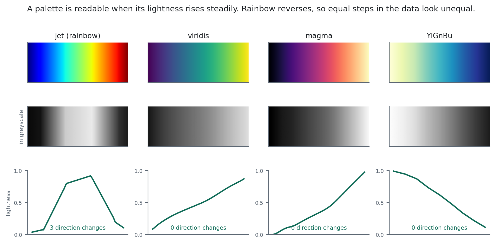

# Composites and Visualisation {#sec-visualisation}

::: {.chapter-goal}
#### In this chapter
You will move from default stretches to deliberate cartography: false colour combinations that make ecological structure visible, stretch bounds chosen from the histogram rather than by trial and error, and palettes that survive being printed in greyscale or read by a colourblind reviewer.
:::

## The last step, and the one that decides whether anyone acts

Chapter 1 argued that a map nobody uses has failed. This is the chapter where that is decided.

A classification with 91 percent accuracy, rendered with a default stretch and an unlabelled rainbow palette, will lose an argument to a worse map that someone can read. That is not an indictment of decision makers. It is what happens when the person who understands the data does not finish the job.

## Anatomy of a visualisation dictionary

Every layer you draw is governed by one small dictionary, and each key is a decision.

```javascript
var vis = {
  bands: ['B4', 'B3', 'B2'],   // which bands feed red, green, blue, in order
  min: 0,                      // the value that maps to black
  max: 0.3,                    // the value that maps to full brightness
  gamma: 1.4,                  // midtone lift, above 1 brightens shadows
  palette: [...]               // single band only, replaces the RGB mapping
};
```

`bands` is order sensitive and this is where most surprises come from. The first band drives red, the second green, the third blue, regardless of what those bands physically are. Swapping two entries produces a completely different looking map from identical data.

`min` and `max` are the stretch, and choosing them by trial and error is the slowest possible method. The histogram tells you directly, and the next section covers it.

`gamma` lifts midtones without blowing out highlights. Values around 1.4 help enormously over tropical coasts, where the interesting material, wet mud and dark canopy, all sits at the bottom of the range.

## The three composites worth knowing

**True colour**, `['B4', 'B3', 'B2']`. Red band to red, green to green, blue to blue. What a passenger in an aircraft would see.

Use it for orientation and for validation with non specialists, because it needs no explanation. Its weakness is exactly the case this book cares about: over a wet tropical delta, everything is dark and low contrast, and mangrove, water and shadow all read as similar dark tones.

**False colour infrared**, `['B8', 'B4', 'B3']`. Near infrared to red, red to green, green to blue.

Vegetation appears bright red, because near infrared is now driving the red channel and healthy vegetation is very bright in near infrared. Water goes near black. Bare soil is cyan to grey.

This is the most useful single composite in vegetation work and it is worth making your default. Dense mangrove reads as saturated crimson; degraded or sparse stands read pink; the distinction is visible at a glance and nearly invisible in true colour.

**Shortwave infrared composite**, `['B12', 'B8', 'B4']` or `['B11', 'B8', 'B4']`.

Shortwave infrared responds to moisture, so this combination separates wet from dry with unusual clarity. Burn scars appear vivid red, wetlands are distinct from dry land, and vegetation moisture stress shows before it is visible elsewhere. For bushfire mapping it is the standard.

| Composite | Bands | Vegetation | Water | Best for |
|---|---|---|---|---|
| True colour | B4 B3 B2 | dark green | dark blue | Orientation, non specialist validation |
| False colour IR | B8 B4 B3 | bright red | black | Vegetation vigour and extent |
| SWIR | B12 B8 B4 | green | dark blue | Moisture, burn scars, wetlands |
| Agriculture | B11 B8 B2 | bright green | dark | Crop condition and stage |

: Standard Sentinel-2 band combinations {.striped}

## Choose the stretch from the histogram

Guessing at `min` and `max` wastes time and produces inconsistent maps between chapters.

Chart the histogram of the band, find where the bulk of the distribution sits, and set the stretch to bracket it. A common convention is the 2nd and 98th percentiles, which clips the extreme tails and uses the full display range on the values that actually occur.

```javascript
var stats = image.select('B8').reduceRegion({
  reducer: ee.Reducer.percentile([2, 98]),
  geometry: aoi,
  scale: 100,
  maxPixels: 1e9
});
print('Stretch bounds:', stats);
```

Two minutes, and the resulting map uses its full dynamic range rather than a guessed fraction of it.

::: {.callout-important}
## Scientific integrity: a stretch is not a result
Two maps of the same data with different stretches can support opposite conclusions about whether a forest is degrading. If you show a before and after pair, **use identical stretch parameters on both**, and say so in the caption.

Changing the stretch between two panels of a comparison is, at best, careless. A reviewer who notices will discount everything else in the figure, and they will be right to.
:::

## Palettes

For a single band, `palette` replaces the RGB mapping with a colour ramp spread evenly between `min` and `max`. Three kinds, and using the wrong one misleads.

**Sequential** for quantities with a natural low to high ordering: elevation, biomass, density. Light to dark in a single hue family. The eye reads darker as more without being told.

**Diverging** for quantities with a meaningful midpoint: change, difference, anomaly. Two hues meeting at a neutral centre. Critically, the midpoint must sit at the meaningful value, usually zero. A diverging palette whose neutral colour lands at an arbitrary value implies a threshold that does not exist.

**Categorical** for classes with no ordering: land cover. Distinct hues of similar lightness, chosen so no class looks more important than another by accident.

{#fig-palette}

::: {.callout-warning}
## Common failure: the rainbow palette
Rainbow, or jet, remains the most used palette in remote sensing and it is a poor choice for continuous data.

The perceptual steps are uneven: the yellow to green transition looks like a large jump, the blue to cyan transition looks small, and the underlying data changes by the same amount in both. Readers see structure that is not there and miss structure that is.

@fig-palette shows both problems at once. The greyscale row is the most damning evidence: rainbow collapses into a pattern that cannot be ordered, while viridis and magma stay readable as gradients.

It is also close to unreadable for the roughly 8 percent of men with red green colour vision deficiency.

Use viridis, magma or a ColorBrewer sequential ramp instead. They are perceptually uniform, greyscale safe and colourblind safe, and they cost nothing to adopt.
:::

## Layer order and the discipline of the Layers panel

`Map.addLayer()` takes five arguments and the last two are consistently underused.

```javascript
Map.addLayer(image, vis, 'False colour', false, 0.7);
//                        name           shown  opacity
```

Passing `false` for `shown` registers the layer in the Layers control without drawing it. This lets you build a dozen diagnostic layers and flick between them without a cluttered map.

Opacity around 0.7 over a satellite basemap is the fastest way to check whether a classification aligns with visible features. Alignment errors that are invisible on an opaque layer become obvious the moment the ground shows through.

Order matters too: the last layer added draws on top. Put the classification above the composite, and the composite above the basemap.

## Making a legend

A categorical map without a legend is decoration. Earth Engine has no automatic legend, so you build one with the `ui` library. Chapter 23 covers this properly as part of application development, but the minimum is worth having now.

```javascript
var legend = ui.Panel({style: {position: 'bottom-left', padding: '8px'}});
legend.add(ui.Label('Land cover', {fontWeight: 'bold'}));

var names = ['Mangrove', 'Other forest', 'Water', 'Bareland', 'Urban'];
var colours = ['#075e11', '#358221', '#1A5BAB', '#FFDB5C', '#ED022A'];

names.forEach(function (name, i) {
  legend.add(ui.Panel({
    widgets: [
      ui.Label('', {backgroundColor: colours[i], padding: '9px', margin: '3px'}),
      ui.Label(name, {margin: '4px 6px'})
    ],
    layout: ui.Panel.Layout.Flow('horizontal')
  }));
});

Map.add(legend);
```

## Designing for the person who will read it

A final check, and it is the one most often skipped.

**Would it survive printing in greyscale?** Many reports still are. Perceptually uniform palettes survive; rainbow does not.

**Is it readable at the size it will actually appear?** A map designed at full screen and reproduced at 8 cm in a report loses every fine distinction. Design at the delivery size.

**Does the colour choice carry an unintended message?** Red reads as danger, green as good. A land cover map using red for mangrove and green for bareland will be misread by everyone who does not stop to check the legend, and most people do not.

<script type="application/json" class="lms-quiz">
{
  "id": "ch13-visualisation",
  "questions": [
    {
      "q": "In a false colour infrared composite, why does healthy vegetation appear bright red?",
      "options": [
        "Chlorophyll reflects red strongly",
        "The near infrared band is assigned to the red display channel, and vegetation is very bright in near infrared",
        "The red band is boosted by gamma",
        "It is a rendering artefact"
      ],
      "answer": 1,
      "why": "Nothing physical changed. Band order in the visualisation dictionary decides which measurement drives which display channel, which is why swapping two entries produces a completely different looking map from identical data."
    },
    {
      "q": "You are showing a 2016 and 2023 composite side by side to demonstrate degradation. What must be true?",
      "options": [
        "Both should use their own optimal stretch for clarity",
        "Both must use identical stretch parameters, stated in the caption",
        "The later image should use a wider stretch",
        "Stretch does not affect a visual comparison"
      ],
      "answer": 1,
      "why": "Different stretches on the two panels can manufacture or hide a difference. A reviewer who notices will discount the whole figure, and they will be right to."
    },
    {
      "q": "What is the main problem with a rainbow palette for continuous data?",
      "options": [
        "It uses too many colours",
        "Its perceptual steps are uneven, so readers see structure that is not in the data and miss structure that is",
        "It renders slowly",
        "It is not supported in Earth Engine"
      ],
      "answer": 1,
      "why": "The yellow to green transition looks like a large jump and blue to cyan looks small, for equal changes in the data. It also fails in greyscale and for red green colour vision deficiency."
    },
    {
      "q": "What is the fastest way to choose min and max for a stretch?",
      "options": [
        "Trial and error until it looks right",
        "Compute the 2nd and 98th percentiles of the band over the area of interest",
        "Always use 0 and 3000",
        "Use the band's data type range"
      ],
      "answer": 1,
      "why": "Percentiles clip the extreme tails and spend the display range on values that actually occur. Two minutes, and the map uses its full dynamic range rather than a guessed fraction."
    }
  ]
}
</script>

## Exercises {.unnumbered}

1. Render the same composite in true colour, false colour infrared and shortwave infrared. Which one makes the mangrove boundary clearest, and why?
2. Compute the 2nd and 98th percentiles for B8 over your area and compare that stretch to your previous guess.
3. Take a classification you made in Chapter 16 and render it in rainbow, then in viridis. Convert both to greyscale. Which survives?
4. Build a legend for your land cover map and show it to someone outside the field. Ask them what the map says. Their answer is your real result.
