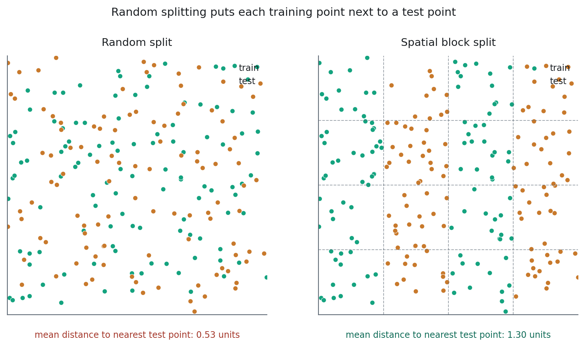

# Ground Truth and Sampling Design {#sec-sampling}

::: {.chapter-goal}
#### In this chapter
You will design a training and validation scheme a reviewer cannot dismantle: stratified across classes, balanced so rare classes survive, spatially thinned so neighbouring pixels do not leak between splits, and exported so every later experiment uses the same samples.
:::

## The step where accuracy is actually decided

Swapping Random Forest for gradient boosting moves accuracy by a point or two. Fixing a sampling design moves it by ten, and more importantly it changes whether the number you report is true rather than merely large.

This asymmetry is not obvious from the literature, because papers compare models and rarely compare sampling schemes. It becomes very obvious after a few years of operational work, where the same model over the same imagery produces a usable map or an unusable one depending entirely on what it was shown.

So this chapter comes before the classifier chapter, and it is longer than most people expect a chapter about drawing polygons to be.

## What a training sample actually is

A training sample is a claim. It says: at this location, on this date, the land cover was this class, and I am confident enough to teach a model from it.

Three things follow from taking that seriously.

The claim has to be true at the **acquisition date**, not today. A polygon drawn over current high resolution basemap imagery, used to train a model on a 2019 composite, is teaching the model 2024's land cover. Over a delta where aquaculture ponds expand yearly, that error is large and systematic.

The claim has to be **pure**. A polygon that includes a sliver of tidal creek is telling the model that water is mangrove. At the edge of a class, do not draw. The interior of a homogeneous patch is where confident labels live.

And the claim has to be **verifiable by someone else**. If you cannot say why a polygon is mangrove rather than other forest, neither can a reviewer, and the map inherits that uncertainty.

::: {.callout-important}
## Scientific integrity: your labels cap your accuracy
If five percent of your samples are mislabelled, no model can exceed 95 percent, and the confusion matrix will not tell you which five percent. Checking twenty random samples against independent imagery before training costs twenty minutes and tells you the ceiling you are working under. Almost nobody does it.
:::

## Points, polygons, and the pixel count illusion

Both approaches are defensible and they fail differently.

**Polygons** capture within class variability. A forest polygon spanning sunlit crowns and shadowed gaps teaches the model that both are forest, which a single point cannot. They also invite edge contamination, and they create an illusion worth naming.

Thirty polygons at Sentinel-2 resolution can yield forty thousand pixels. That looks like an enormous training set. It is not. Every pixel inside one polygon is nearly identical to its neighbours, so the effective sample size is closer to thirty than to forty thousand. A model validated on those pixels reports an accuracy that means almost nothing, because the validation pixels are near duplicates of the training pixels.

**Points** are precise and independent, and they under represent variability unless you place a lot of them.

The route this book takes is the one most operational work converges on: draw small, confidently pure polygons, then sample a controlled number of **points** from inside them. Polygon convenience, point statistics.

## Stratification, and why equal is not fair

`stratifiedSample()` guarantees a number of points per class rather than sampling in proportion to area. That distinction is the entire reason it exists.

In a coastal scene, water might cover 40 percent of the frame and a newly restored mangrove patch 0.3 percent. Proportional random sampling returns roughly 400 water points and 3 restoration points, and the model learns that predicting water is nearly always safe. Stratification forces the rare class to be represented.

Equal targets per class are not automatically correct either. Sample sizes should follow how hard a class is, not how many classes there are.

| Class | Why the target is what it is |
|---|---|
| Mangrove | The class of interest. Errors here matter most. Sample heavily. |
| Other forest | The main confusion partner. The boundary between these two is where accuracy is won or lost, so it needs as much data as the target class. |
| Water | Spectrally distinct, easy, low internal variability. Fewer points suffice. |
| Bareland or agriculture | Enormous internal variability: dry soil, wet soil, crops at every growth stage. Needs more than its area suggests. |
| Urban | Distinct, but heterogeneous at pixel level. A middle amount. |

: Sample targets follow difficulty, not area {.striped}

## Spatial autocorrelation, the quiet accuracy inflator

Two samples ten metres apart are, for practical purposes, one sample measured twice. They share illumination, atmosphere, canopy and often the same tree.

If one lands in training and its twin in validation, the model is being tested against data it has effectively already seen. Accuracy comes back four to eight points too high, consistently, and nothing in the output looks wrong.

This is the main reason internal accuracy so often exceeds field accuracy by a wide margin. It is not overfitting in the textbook sense. The validation set was simply never independent.

The fix is to thin: enforce a minimum separation between samples. The script below snaps samples to a coarse grid and keeps one per cell, which is unsophisticated and captures nearly all of the available benefit.

::: {.callout-warning}
## Common failure: splitting the pixels instead of the points
```javascript
// Wrong. Pixels from the same polygon end up on both sides.
var samples = image.sampleRegions({collection: polygons, ...});
var split = samples.randomColumn('random');

// Right. Split the points first, then sample the image with each set.
var split = points.randomColumn('random');
var training = split.filter(ee.Filter.lt('random', 0.7));
var validation = split.filter(ee.Filter.gte('random', 0.7));
```
The two versions produce results that look identical and differ by several accuracy points. Chapter 16 asks you to run both and measure the gap yourself.
:::

## The full workflow



## Two checks before you trust the samples

**Spectral separability.** Plot two predictor bands against each other, coloured by class. If mangrove and other forest overlap completely on NDVI but separate along radar backscatter, you have just confirmed why Chapter 10 put radar in the stack. If two classes overlap on everything, no classifier will separate them, and you should either merge them or find another predictor.

**Where the samples are.** Map them. This catches clustering in one convenient corner, a class drawn only on one side of the river, and points that fell in the sea. Thirty seconds, and it has saved a lot of afternoons.


## Thinning is not enough: spatial block cross validation

Thinning enforces a minimum distance between samples, and it treats a symptom. Tobler's first law does not stop at 60 metres.

Samples drawn from the same estuary share tide state, water chemistry, species composition, sun angle and atmospheric conditions, whatever the spacing between them. A model can learn *this estuary looks like this* and score beautifully on held out points from the same estuary, then fail on the next one along the coast. Random splitting measures interpolation within a landscape and reports it as though it were prediction.

That failure mode has a name, **spatial data leakage**, and it is the reason models reporting 95 percent in validation routinely deliver 60 percent when applied to a neighbouring province.

::: {.callout-important}
## Scientific integrity: which number to report
If a model will only ever be applied to the area it was trained on, a random split is a fair description of its performance. The moment anyone might apply it elsewhere, and in practice they always do, the random split figure is an overstatement.

Report both, and label them. Quoting only the random split is not wrong so much as incomplete, and a reviewer who knows this literature will ask.
:::

{#fig-blockcv}

The distances under each panel are computed, not illustrative. In the random split the mean distance from a training point to the nearest test point is 0.53 units; under block splitting it is 1.30.

### How blocks fix it

Partition the study area into geographic blocks. Assign **whole blocks** to folds, never individual points. Train on some blocks, test on the ones held out. The model is forced to generalise across space rather than interpolate within it.

Block size is the parameter that matters, and it is an ecological decision rather than a statistical one.

Too small, and adjacent blocks stay correlated, so you have only made the random split slightly harder. Too large, and each fold covers a different landscape entirely, so the score reflects landscape difference rather than model quality.

The defensible starting point is the range over which your predictors are autocorrelated. You can estimate that from a semivariogram, or approximate it from what you know of the landscape. Over a delta, the scale at which conditions genuinely change is the sub estuary, a few kilometres.



### Reading the result

Two numbers come out, and both matter.

**The mean across folds** is your honest accuracy. Compare it to the random split figure from the same data. A gap of two to four points is normal. A gap of ten or more means the random split was measuring something other than what you thought.

**The standard deviation across folds** is the number almost nobody reports and it may be the more useful one. A model scoring 0.84 plus or minus 0.02 transfers reliably. The same mean at plus or minus 0.15 works in some parts of the landscape and fails in others, which is a fact somebody should know before making a decision from the map.

::: {.callout-tip}
## From the field
Vary the block size from 1 km to 20 km and plot accuracy against it. Accuracy falls as blocks grow, then flattens. The point where it stops falling is an empirical estimate of your data's autocorrelation range, obtained without fitting a variogram. It also tells you how far apart two study areas must be before a model trained on one says anything useful about the other.
:::

## Independent validation is a different thing

Everything above splits one dataset. That is internal validation, and it answers a narrow question: does the model generalise to points I did not train on, drawn the same way, by the same person, from the same imagery.

It cannot detect a systematic error in your labelling. If you consistently confuse *Nypa* palm for mangrove, both splits contain that confusion and the confusion matrix reports excellent accuracy.

Independent validation uses data collected by a different process. Field plots, in this book's case CIFOR plot data from West Papua. High resolution commercial imagery interpreted by someone who did not draw the training polygons. An existing product such as Global Mangrove Watch, used as a cross check rather than as truth.

The gap between internal and independent accuracy is the honest number, and Chapter 17 is about reporting it.

<script type="application/json" class="lms-quiz">
{
  "id": "ch15-sampling",
  "questions": [
    {
      "q": "Thirty polygons yield forty thousand training pixels. Why is that not a large training set?",
      "options": [
        "Forty thousand is small by machine learning standards",
        "Pixels inside one polygon are near duplicates, so the effective sample size is closer to thirty",
        "Polygons cannot be used with Random Forest",
        "The pixels are at the wrong scale"
      ],
      "answer": 1,
      "why": "Spatial autocorrelation means neighbouring pixels carry almost no independent information. The count looks impressive and the statistics behave as though you had thirty samples."
    },
    {
      "q": "Why does stratifiedSample exist, given that random sampling is simpler?",
      "options": [
        "It runs faster on large regions",
        "It guarantees representation for rare classes that proportional sampling would nearly miss",
        "It automatically removes mislabelled points",
        "It returns points rather than polygons"
      ],
      "answer": 1,
      "why": "A class covering 0.3 percent of the scene gets about three points from proportional sampling. Stratification forces it to be represented so the model has something to learn from."
    },
    {
      "q": "You split the samples after calling sampleRegions rather than before. What is the consequence?",
      "options": [
        "The script fails with a band mismatch error",
        "Nothing, the two orders are equivalent",
        "Pixels from the same polygon land in both splits, inflating reported accuracy by several points",
        "Training becomes much slower"
      ],
      "answer": 2,
      "why": "The failure is silent. The map looks the same, the accuracy is several points too high, and nothing in the output signals a problem."
    },
    {
      "q": "What can internal validation NOT detect?",
      "options": [
        "A model that memorised its training data",
        "A systematic labelling error, such as consistently calling Nypa palm mangrove",
        "A class with too few samples",
        "An unstable classifier"
      ],
      "answer": 1,
      "why": "Both splits inherit the same mistake, so the confusion matrix reports excellent accuracy. Only independently collected reference data exposes it."
    },
    {
      "q": "You thinned your samples to a 60 m minimum separation. Why might reported accuracy still be inflated?",
      "options": [
        "60 m is too small a separation for Sentinel-2",
        "Samples from the same estuary still share tide, chemistry, species and atmosphere, so the model can learn the place rather than the class",
        "Thinning removes too many samples to be reliable",
        "Thinning only works for polygon based sampling"
      ],
      "answer": 1,
      "why": "Thinning treats a symptom. Autocorrelation does not stop at 60 m, which is why block cross validation partitions whole regions rather than enforcing a distance."
    },
    {
      "q": "Block CV gives 0.84 with a standard deviation of 0.15 across folds. What does the spread tell you?",
      "options": [
        "The model is unstable and needs more trees",
        "The blocks were too small",
        "The model works in some parts of the landscape and fails in others, which someone should know before acting on the map",
        "The result is invalid and should be discarded"
      ],
      "answer": 2,
      "why": "The mean is the headline; the spread is often more useful. A wide spread is a real finding about where the map can and cannot be trusted, not a defect to hide."
    }
  ]
}
</script>

## Exercises {.unnumbered}

1. Set every class target to the same value and rerun. Which class becomes harder to model, and why does equal sampling not mean fair sampling?
2. Disable thinning by setting the minimum separation to 10 metres, then run Chapter 16 with the result. Record how much reported accuracy rises. Keep the number.
3. Export the samples as CSV and check twenty at random against high resolution imagery. Your mislabel rate is the ceiling on your map's accuracy.
4. Draw training polygons for a class you consider easy, then ask a colleague to draw them independently. Compare. The disagreement rate is more informative than most model tuning.
