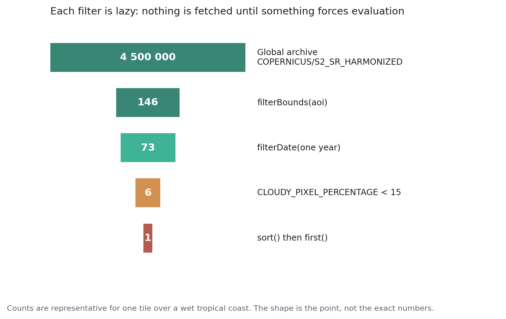

# Mengambil Aliran Data Optik {#sec-optical}

::: {.chapter-goal}
#### Dalam bab ini
Anda akan memilih antara Landsat dan Sentinel-2 berdasarkan bukti, bukan kebiasaan, menyaring arsip global menjadi satu citra layak pakai dalam empat baris, dan mengetahui metadata mana yang benar benar layak dijadikan filter.
:::

## Dua kuda beban

Hampir semua analisis optik di pemantauan lingkungan berjalan di atas salah satu dari dua program, dan pilihannya ditentukan oleh apa yang perlu Anda lihat dan seberapa jauh ke belakang Anda perlu melihatnya.

| | Landsat 8 dan 9 | Sentinel-2 |
|---|---|---|
| Ukuran piksel, tampak dan NIR | 30 m | 10 m |
| Inframerah gelombang pendek | 30 m | 20 m |
| Kunjungan ulang, konstelasi penuh | 8 hari | 5 hari |
| Arsip dimulai | 1972 untuk program | 2015 |
| Band red edge | tidak ada | tiga |
| Band termal | dua | tidak ada |

: Memilih di antara dua arsip optik utama {.striped}

Aturannya sederhana. Kalau pertanyaan Anda memerlukan riwayat sebelum 2015, misalnya garis dasar deforestasi, perubahan pesisir jangka panjang, atau pertumbuhan kota lintas dekade, Anda memerlukan Landsat dan tidak ada penggantinya. Kalau pertanyaan Anda memerlukan kerincian spasial atau kepekaan terhadap cekaman vegetasi, misalnya petak petani kecil, jalur mangrove sempit, atau kondisi tanaman, Sentinel-2 unggul jelas. Kalau pertanyaan Anda memerlukan suhu permukaan lahan, hanya Landsat yang membawa sensor termal.

Banyak proyek serius memakai keduanya: Landsat untuk garis dasar historis, Sentinel-2 untuk kerincian masa kini. Bab 21 menangani harmonisasi yang membuat penggunaan bersama itu bisa dipertahankan.

::: {.callout-note}
## Konsep: red edge
Sentinel-2 membawa tiga band sempit antara merah dan inframerah dekat, kira kira pada 705, 740, dan 783 nanometer. Serapan klorofil menurun sangat curam di sepanjang interval itu, dan posisi tepat penurunannya bergeser ketika tanaman tertekan, jauh sebelum perubahannya terlihat mata atau terbaca NDVI. Inilah sebabnya Sentinel-2 mengungguli Landsat untuk kondisi tanaman dan deteksi penyakit dengan selisih yang jauh lebih besar daripada yang bisa dijelaskan perbedaan resolusi saja.
:::

## Koleksi, dan huruf huruf yang menentukan

Pengenal dataset memuat tingkat pemrosesan, dan salah memilih membatalkan pekerjaan kuantitatif tanpa memunculkan galat apa pun.

`COPERNICUS/S2_HARMONIZED` adalah Level-1C: reflektansi puncak atmosfer. Atmosfernya masih ada di dalam pengukuran.

`COPERNICUS/S2_SR_HARMONIZED` adalah Level-2A: reflektansi permukaan, sudah dikoreksi atmosfer. **Pakai yang ini** untuk apa pun yang nilainya harus sebanding antar tanggal atau antar lokasi.

`LANDSAT/LC09/C02/T1_L2` adalah Landsat 9, Collection 2, Tier 1, Level-2. Tier 1 berarti registrasi geometriknya memenuhi standar ketat, dan itulah yang Anda inginkan. Citra Tier 2 ada dan bisa dipakai untuk keperluan visual, tetapi sebaiknya dikeluarkan dari analisis deret waktu.

::: {.callout-warning}
## Kesalahan umum: mencampur tingkat pemrosesan
NDVI yang dihitung pada Level-1C dan NDVI yang dihitung pada Level-2A di atas hutan yang sama akan berbeda, kadang cukup jauh, karena hamburan atmosfer memengaruhi band merah lebih besar daripada inframerah dekat. Deret waktu yang berpindah pindah di antara keduanya akan menunjukkan lompatan yang bentuknya persis seperti peristiwa ekologis sungguhan. Tetapkan koleksinya sekali, di bagian atas skrip, dan jangan pernah mengubahnya di tengah analisis.
:::

## Rantai filter

{#fig-funnel}

@fig-funnel menunjukkan bentuk yang berlaku hampir di setiap alur kerja optik: koleksi, `filterDate`, `filterBounds`, filter metadata, `sort`, lalu `first`. Angkanya representatif untuk satu tile di pesisir tropis basah selama satu tahun, dan yang penting adalah bentuknya, bukan angka persisnya.



## Membaca rantainya

Empat filter mengerjakan tugasnya, dan masing masing bekerja pada hal yang berbeda.

`filterDate()` membatasi berdasarkan waktu perekaman. Tanggal akhirnya bersifat eksklusif, dan ini menjebak orang di batas tahun: `filterDate('2023-01-01', '2023-12-31')` melewatkan hari terakhir tahun itu. Pakai `'2024-01-01'` sebagai batas atas kalau Anda memang menginginkan satu tahun penuh.

`filterBounds()` membatasi berdasarkan geografi. Ia menyimpan setiap citra yang jejaknya berpotongan dengan geometri Anda, yang untuk sebuah titik berarti persis citra citra yang meliput titik itu.

`filter(ee.Filter.lt(...))` membatasi berdasarkan metadata. `CLOUDY_PIXEL_PERCENTAGE` hanyalah satu di antara banyak properti yang dibawa citra Sentinel-2. Yang lain yang layak diketahui adalah `MGRS_TILE`, yang mengunci Anda pada satu sel grid tile, dan `SENSING_ORBIT_NUMBER`, yang berguna ketika geometri pengamatan perlu konsisten.

`sort()` lalu `first()` memilih satu citra. Pengurutannya menaik secara baku, jadi citra paling sedikit awannya berada di urutan pertama.

::: {.callout-important}
## Integritas ilmiah: awan tingkat citra adalah alat tumpul
`CLOUDY_PIXEL_PERCENTAGE` menjelaskan satu citra utuh, kira kira 110 kilometer persegi. Citra yang dilaporkan 40 persen berawan bisa jadi sepenuhnya cerah di atas area studi Anda yang sepuluh kilometer, dan citra yang dilaporkan 5 persen berawan bisa jadi seluruh awannya duduk tepat di atas lokasi Anda. Memfilter properti ini praktis untuk memilih satu citra yang akan dilihat. Ia alat yang keliru untuk membangun composite, dan Bab 9 menggantinya dengan cloud masking per piksel.
:::

## Memeriksa sebelum melanjutkan

Ada dua pernyataan `print` yang layak ada di setiap skrip pengambilan data, dan ketiadaannya menjelaskan sebagian besar galat membingungkan di tahap berikutnya.

```javascript
print('Jumlah citra setelah filter:', filtered.size());
```

Kalau ini mengembalikan nol, semua yang ada di bawahnya akan gagal dengan cara yang tidak menyebut nyebut filter. Penyebab lazimnya adalah koordinat yang ditulis lintang lebih dulu, rentang tanggal dengan tahun yang keliru, atau ambang awan yang begitu ketat sampai tidak ada yang lolos.

```javascript
print('Tanggal perekaman:', filtered.aggregate_array('system:time_start')
  .map(function (millis) { return ee.Date(millis).format('YYYY-MM-dd'); }));
```

Yang ini memunculkan lubang temporal. Koleksi berisi tiga puluh citra terdengar sehat sampai tanggalnya menunjukkan bahwa dua puluh delapan di antaranya jatuh di musim kemarau dan musim hujan praktis tidak terpantau sama sekali. Ketimpangan itu akan membiaskan composite apa pun yang dibangun darinya, dan ia tidak terlihat kecuali Anda memeriksanya.

## Faktor skala dan jebakan offset

Reflektansi Sentinel-2 Level-2A disimpan sebagai bilangan bulat yang diskalakan 10.000. Nilai tersimpan 2.500 berarti reflektansi 0,25. Landsat Collection 2 Level-2 memakai konvensi berbeda lagi, dengan faktor skala sekaligus offset penjumlahan:

```javascript
// Landsat Collection 2 Level-2 ke satuan fisik
var scaled = image.select('SR_B.*').multiply(0.0000275).add(-0.2);
```

Indeks ternormalisasi seperti NDVI kebal terhadap faktor skala murni, karena faktornya saling meniadakan dalam rasio. Indeks itu **tidak** kebal terhadap offset penjumlahan, dan tidak kebal terhadap pencampuran band yang sudah diskalakan dengan yang belum di dalam satu ekspresi. Terapkan konversinya satu kali, langsung setelah pemuatan, dan bekerjalah dalam satuan fisik setelah itu.

<script type="application/json" class="lms-quiz">
{
  "id": "ch08-optical",
  "questions": [
    {
      "q": "Mengapa buku ini bersikeras memakai koleksi _SR_ dan bukan Level-1C?",
      "options": [
        "Resolusinya lebih tinggi",
        "Level-2A sudah dikoreksi atmosfer, sehingga nilainya sebanding antar tanggal dan antar lokasi",
        "Level-1C sudah tidak didukung",
        "Bandnya lebih banyak"
      ],
      "answer": 1,
      "why": "Deret waktu NDVI yang berpindah antar tingkat pemrosesan menunjukkan lompatan yang bentuknya persis seperti peristiwa ekologis sungguhan."
    },
    {
      "q": "filterDate('2023-01-01', '2023-12-31') untuk satu tahun penuh. Apa yang keliru?",
      "options": [
        "Tidak ada yang keliru",
        "Tanggal akhirnya eksklusif, jadi 31 Desember terlewat; pakai 2024-01-01",
        "Tanggalnya perlu ditambah jam",
        "Urutannya harus dibalik"
      ],
      "answer": 1,
      "why": "Kesalahan kecil yang diam diam membuang satu hari, dan pada perulangan multi tahun ia membuang satu hari setiap tahun."
    },
    {
      "q": "Sebuah citra melaporkan CLOUDY_PIXEL_PERCENTAGE sebesar 40. Bisa dipakai?",
      "options": [
        "Tidak, apa pun di atas 20 harus dibuang",
        "Mungkin bisa: angka itu menjelaskan citra seluas 110 km, jadi awannya bisa saja berada sepenuhnya di luar area studi Anda",
        "Hanya untuk visualisasi",
        "Hanya kalau cloud masking per piksel juga diterapkan"
      ],
      "answer": 1,
      "why": "Awan tingkat citra adalah alat tumpul. Ia memadai untuk memilih satu citra yang akan dilihat, dan keliru untuk membangun composite."
    },
    {
      "q": "Apa yang dilakukan offset penjumlahan, seperti pada Landsat Collection 2, terhadap indeks ternormalisasi yang tidak dilakukan faktor skala?",
      "options": [
        "Tidak ada bedanya, keduanya saling meniadakan",
        "Faktor skala murni meniadakan diri dalam rasio; offset penjumlahan tidak, jadi ia harus diterapkan sebelum indeks dihitung",
        "Ia mengubah nama band",
        "Ia hanya memengaruhi visualisasi"
      ],
      "answer": 1,
      "why": "Inilah sebabnya konversinya diletakkan tepat setelah pemuatan. Terapkan sekali, lalu bekerja dalam satuan fisik seterusnya."
    }
  ]
}
</script>

## Latihan {.unnumbered}

1. Jalankan skripnya di area studi Anda sendiri. Catat berapa citra yang lolos setiap filter berturut turut, dan identifikasi filter mana yang membuang paling banyak.
2. Naikkan ambang awan bertahap dari 5 ke 80 persen. Pada ambang berapa citra terbaik menjadi layak pakai, dan apa yang itu beri tahu tentang iklim setempat?
3. Muat arsip Landsat 9 Collection 2 Level-2 di area dan tahun yang sama. Terapkan skala dan offsetnya, tampilkan dalam warna sejati, lalu bandingkan secara visual dengan hasil Sentinel-2.
4. Cetak seluruh metadata satu citra dan temukan tiga properti, selain persentase awan, yang bisa berguna dijadikan filter.
