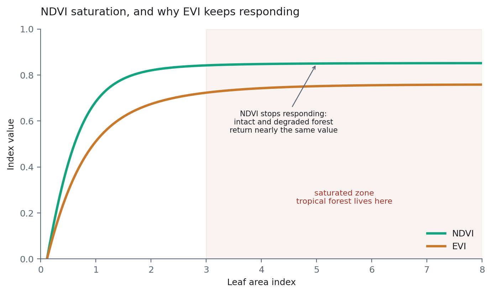

# Matematika Band dan Indeks Spektral {#sec-indices}

::: {.chapter-goal}
#### Dalam bab ini
Anda akan membangun pustaka indeks standar dari prinsip dasar, bukan menyalin rumus, mempelajari di mana masing masing berhenti bekerja, dan menulis indeks sendiri dengan `ee.Image.expression`. Indeks yang tidak bisa Anda jelaskan adalah indeks yang tidak bisa Anda debug.
:::

## Satu bentuk, hampir seluruh bidang ini

Hampir setiap indeks dalam penginderaan jauh adalah variasi dari satu bentuk:

$$\frac{A - B}{A + B}$$

Dua sifat menjelaskan kenapa bentuk ini mendominasi.

Ia **terbatas** antara -1 dan 1 berapa pun besaran masukannya, sehingga nilainya sebanding antar citra, antar sensor, dan antar tanggal tanpa kalibrasi tambahan.

Dan ia **meniadakan efek multiplikatif**. Kalau sebuah lereng berada dalam bayangan sebagian, setiap band diperkecil oleh faktor yang kira kira sama. Faktor itu muncul di pembilang sekaligus penyebut lalu saling meniadakan. Karena itu rasio jauh lebih stabil terhadap kondisi pencahayaan dibanding band tunggal mana pun.

Yang tidak diniadakannya adalah efek **penjumlahan**. Radiansi jalur atmosfer menambah nilai pada setiap band, dan tidak merata, dan tidak ada rasio yang menghilangkannya. Inilah alasan konkret Bab 8 bersikeras memakai reflektansi permukaan alih alih puncak atmosfer: koreksinya harus terjadi sebelum indeks dihitung, karena indeks tidak bisa membatalkannya.

## Indeks vegetasi

**NDVI**, $(NIR - Merah)/(NIR + Merah)$, mengikuti langsung dari fisika di Bab 2. Klorofil menyerap merah; mesofil daun menghamburkan inframerah dekat. Tajuk sehat yang rapat punya jarak besar di antara keduanya.

Mode kegagalannya lebih penting daripada rumusnya. Begitu indeks luas daun melewati sekitar 3, daun tambahan berhenti menaikkan reflektansi inframerah dekat secara berarti, dan NDVI mendatar di sekitar 0,8 sampai 0,9. Inilah **kejenuhan**, dan hutan tropis hidup permanen di dalamnya.

{#fig-saturation}

@fig-saturation adalah argumennya dalam satu gambar. Konsekuensi praktisnya: NDVI membedakan hutan dari bukan hutan dengan sangat baik, dan membedakan hutan terdegradasi dari hutan utuh nyaris tidak sama sekali. Kalau pertanyaan Anda tentang kondisi hutan dan bukan luas hutan, NDVI saja tidak akan menjawabnya, dan klasifikasi sebaik apa pun tidak akan menyelamatkannya.

**EVI** terus merespons di tempat NDVI sudah jenuh. Tiga tambahan mengerjakan tugasnya: suku biru yang mengoreksi sisa hamburan atmosfer, penyesuaian tanah pada penyebut yang mengurangi pengaruh latar, dan gain yang menskalakan ulang keluarannya. Koefisiennya adalah nilai baku MODIS, bersifat empiris dan bukan diturunkan. Pertahankan kecuali Anda punya alasan spesifik beserta rujukannya.

**SAVI** menambahkan koreksi kecerahan tanah $L$. Pada $L = 0{,}5$ ia cocok untuk tutupan menengah; $L = 1$ untuk tutupan jarang, $L = 0{,}25$ untuk rapat. Pada $L = 0$ ia berubah persis menjadi NDVI, dan itu pemeriksaan yang berguna untuk memastikan Anda paham apa yang dilakukan parameternya. Ia penting di tepi arah darat dan di atas tegakan muda hasil penanaman ulang, tempat lumpur terang di sela tajuk menggelembungkan NDVI.

## Indeks air, dan kenapa yang lebih lama lebih buruk

**NDWI**, $(Hijau - NIR)/(Hijau + NIR)$, membalik logika NDVI. Air memantul sedang di hijau dan menyerap inframerah dekat, sehingga air terbuka menjadi sangat positif.

Kegagalannya spesifik dan lazim: beton dan atap logam juga punya inframerah dekat rendah relatif terhadap hijau, sehingga NDWI mengklasifikasikan area perkotaan sebagai air dengan keteraturan yang menyedihkan.

**MNDWI** menukar inframerah dekat dengan inframerah gelombang pendek. Air menyerap gelombang pendek bahkan lebih tuntas, sedangkan permukaan terbangun memantulkannya, sehingga kekeliruan perkotaan itu sebagian besar hilang.

Di atas delta yang penuh tambak, jalan, dan permukiman, MNDWI adalah pilihan baku yang lebih baik. NDWI adalah pilihan historisnya. Pakai MNDWI kecuali Anda memerlukan kesinambungan dengan pekerjaan terdahulu, dan sebutkan yang mana yang Anda pakai.

## Konstruksi khusus mangrove

Indeks umum memisahkan vegetasi dari air. Pemetaan mangrove perlu memisahkan vegetasi yang *berdiri di dalam* air dari vegetasi yang tidak, dan itu pertanyaan berbeda yang menuntut konstruksi berbeda.

**CMRI**, Combined Mangrove Recognition Index, cukup $NDVI - NDWI$. Logikanya langsung: mangrove satu satunya tipe tutupan yang sekaligus tinggi sinyal vegetasinya dan berdampingan dengan atau berada di atas air. Pengurangan itu mendorong hutan daratan ke atas, karena NDVI-nya tinggi dan NDWI-nya sangat negatif, dan mendorong air terbuka ke bawah, sehingga mangrove tersisa di pita tengah yang bisa dibedakan.

**MVI**, Mangrove Vegetation Index, adalah $(NIR - Hijau)/(SWIR_1 - Hijau)$. Berbeda dari semua yang di atas, ini bukan beda ternormalisasi, sehingga ia tidak terbatas dan menghasilkan nilai ekstrem di mana pun penyebutnya mendekati nol. Jagalah hal itu secara eksplisit. Dalam perbandingan yang dipublikasikan, ia memisahkan mangrove dari vegetasi daratan lebih bersih daripada NDVI saja.

::: {.callout-note}
## Konsep: kenapa indeks yang dirancang khusus bisa mengalahkan yang umum
NDVI menjawab "apakah ini berfotosintesis", dan setiap benda hijau menjawab ya. CMRI menjawab "apakah ini berfotosintesis *dan* basah", dan himpunan jawabannya jauh lebih kecil. Merancang indeks sebagian besar adalah latihan menemukan pertanyaan yang himpunan jawabannya mendekati kelas yang Anda inginkan.

Meski begitu, indeks adalah fitur yang dirancang tangan, dan Bab 19 menunjukkan apa yang terjadi ketika sebuah model fondasi merancang enam puluh empat fitur untuk Anda. Memahami konstruksi indeks tetap sepadan, karena dari situlah Anda mendiagnosis apa yang sedang dilakukan embedding ketika ia keliru.
:::

## Alur kerja lengkap



## Dua jebakan yang menghasilkan jawaban salah yang terlihat masuk akal

::: {.callout-warning}
## Kesalahan umum: normalizedDifference menamai band Anda 'nd'
`normalizedDifference()` menamai keluarannya `nd` apa pun masukannya. Hitung dua indeks tanpa mengganti nama dan Anda punya dua band yang sama sama bernama `nd`; `addBands` menyimpan satu dan membuang yang lain tanpa bersuara.

Galatnya muncul jauh di kemudian hari, sebagai classifier yang anehnya mengabaikan prediktor yang Anda yakin sudah ditambahkan. Selalu rangkaikan `.rename()`.
:::

::: {.callout-warning}
## Kesalahan umum: pembagian bilangan bulat memotong hasilnya
Hitung indeks pada reflektansi bilangan bulat yang belum diskalakan tanpa pengecoran tipe, dan pembagiannya membulatkan ke arah nol. Anda mendapat citra berisi nol dan satu, yang tampil sebagai mask biner yang terlihat masuk akal dan karena itu lolos dari pemeriksaan.

Menskalakan ke reflektansi fisik satu kali, tepat setelah cloud masking, membuat semuanya float dan menghindari ini sepenuhnya. Verifikasi dengan Inspector, bukan dengan mata: klik piksel hutan dan pastikan NDVI-nya terbaca sekitar 0,83, bukan 0 atau 1.
:::

## Indeks mana memisahkan pasangan mana

Sebuah indeks tidak baik atau buruk secara umum. Ia baik atau buruk pada satu pembedaan tertentu, di atas satu bentang lahan tertentu, dan satu satunya cara mengetahuinya adalah menghitungnya. Kisi di bawah melakukan itu untuk setiap indeks dalam bab ini terhadap setiap pasangan kelas pada citra pesisir tropis.

```{python}
#| label: fig-index-grid
#| fig-cap: "Pemisahan yang dicapai setiap indeks pada setiap pasangan kelas, dari spektrum representatif di Bab 2. Makin gelap makin terpisah. Arahkan kursor ke sel mana pun untuk selisih persisnya. MVI dikeluarkan karena tidak terbatas dan akan mendominasi skalanya tanpa bisa dibandingkan. CMRI adalah selisih dari dua normalised difference, sehingga rentangnya dua kali yang lain dan terbaca lebih gelap sebagian karena itu saja; bandingkan ia dengan yang lain lewat peringkat, bukan lewat gelap terangnya."
import itertools
import numpy as np
import plotly.graph_objects as go
import booklib as bk

kelas = ["Healthy mangrove", "Other dense forest", "Oil palm",
         "Open water", "Turbid water", "Tidal mudflat", "Bare soil"]
indeks = [k for k in bk.INDICES if k != "MVI"]        # hanya indeks terbatas

pasangan = list(itertools.combinations(kelas, 2))
grid = np.array([[bk.separability(i, a, b) for a, b in pasangan] for i in indeks])

fig = go.Figure(go.Heatmap(
    z=grid,
    x=[f"{bk.label(a, 'id').split()[0]} / {bk.label(b, 'id').split()[0]}"
       for a, b in pasangan],
    y=indeks,
    colorscale=[[0, "#ffffff"], [0.25, "#cfe9df"], [0.6, bk.BRIGHT], [1, bk.TEAL]],
    colorbar=dict(title="Selisih"),
    hovertemplate="%{y} memisahkan %{x} sebesar %{z:.3f}<extra></extra>",
))
fig.update_xaxes(tickangle=-55, tickfont=dict(size=9))
bk.show(fig, height=430)
```

Dua kolom yang perlu diperhatikan adalah yang pucat. Mangrove lawan hutan lebat lain, dan air terbuka lawan air keruh, pucat di hampir setiap indeks, dan itu ringkasan jujur tentang apa yang bisa dan tidak bisa dilakukan band math: ia memisahkan bahan yang berbeda pada band yang Anda miliki, dan dua tajuk berdaun lebar yang rapat nyaris tidak berbeda pada band mana pun.

```{python}
#| label: tbl-index-best
import itertools
import pandas as pd
import booklib as bk

kelas = ["Healthy mangrove", "Other dense forest", "Oil palm",
         "Open water", "Turbid water", "Tidal mudflat", "Bare soil"]

rows = []
for a, b in itertools.combinations(kelas, 2):
    skor = sorted(((bk.separability(i, a, b), i) for i in bk.INDICES
                   if i != "MVI"), reverse=True)
    terbaik, kedua = skor[0], skor[1]
    rows.append({
        "Pasangan": f"{bk.label(a, 'id')} / {bk.label(b, 'id')}",
        "Indeks terbaik": terbaik[1],
        "Selisih": terbaik[0],
        "Peringkat dua": kedua[1],
        "Putusan": "band math cukup" if terbaik[0] > 0.15
                   else "perlu lebih dari band math",
    })

df = pd.DataFrame(rows).sort_values("Selisih")
bk.table(df, caption=(
    "Diurutkan dari yang terburuk. Semua yang berada di atas titik "
    "perubahan putusan adalah pasangan yang tidak akan Anda klasifikasikan "
    "dengan andal hanya dari indeks optik, seperti apa pun tampilan petanya."
))
```

Baca bagian atas tabel itu sebagai rencana kerja. Pasangan yang terdaftar di sana adalah pasangan yang membutuhkan radar, rupa bumi, atau tekstur untuk ditambahkan ke stack, dan itu Bab 10, 11, dan 14; tidak ada rekayasa indeks sebanyak apa pun yang bisa menggantikannya. Pasangan di bagian bawah sudah selesai, dan menghabiskan waktu di sana berarti menghabiskan waktu pada bagian yang sudah bekerja.

::: {.callout-note}
## Apa arti 0,15, dan apa yang bukan
Ambang di kolom terakhir itu aturan praktis, bukan statistik. Ia berasal dari pengamatan bahwa selisih lebih kecil dari sekitar 0,15 pada indeks yang terbatas cenderung berada di dalam variasi antarcitra sebuah composite nyata, sehingga classifier yang dilatih pada satu tahun tidak berpindah ke tahun berikutnya. Anggap ia sebagai titik untuk berhenti menyetel indeks dan mulai menambah sensor, lalu gantikan dengan jarak Jeffries-Matusita pada data latih Anda sendiri begitu Anda punya.
:::

::: {.py-live}
```python
# Setiap indeks terbatas dalam bab ini, pada satu pasangan kelas pilihan Anda.
spektrum = {
    "mangrove":  {"B3": .055, "B4": .030, "B8": .310, "B11": .115},
    "hutan":     {"B3": .052, "B4": .029, "B8": .330, "B11": .135},
    "sawit":     {"B3": .060, "B4": .035, "B8": .345, "B11": .155},
    "lumpur":    {"B3": .100, "B4": .130, "B8": .195, "B11": .230},
    "air":       {"B3": .040, "B4": .025, "B8": .008, "B11": .004},
}

def nd(a, b): return (a - b) / (a + b)

indeks = {
    "NDVI":  lambda r: nd(r["B8"], r["B4"]),
    "NDWI":  lambda r: nd(r["B3"], r["B8"]),
    "MNDWI": lambda r: nd(r["B3"], r["B11"]),
    "NDMI":  lambda r: nd(r["B8"], r["B11"]),
    "CMRI":  lambda r: nd(r["B8"], r["B4"]) - nd(r["B3"], r["B8"]),
}

A, B = "mangrove", "hutan"          # ubah dua nama ini
print(f"{A} lawan {B}\n")

skor = sorted(
    ((abs(f(spektrum[A]) - f(spektrum[B])), nama) for nama, f in indeks.items()),
    reverse=True,
)
for selisih, nama in skor:
    batang = "#" * int(selisih * 60)
    print(f"{nama:6s} {selisih:.3f}  {batang}")

print(f"\nterbaik: {skor[0][1]}"
      f"   {'bisa dipakai' if skor[0][0] > 0.15 else 'belum cukup sendiri'}")

# Coba ini: atur A ke "air" dan B ke "lumpur" untuk pasangan yang mudah
# diselesaikan band math, lalu kembali ke mangrove dan hutan untuk pasangan
# yang tidak. Setelah itu buat indeks Anda sendiri: tambahkan satu baris ke
# kamus di atas dan lihat di mana ia mendarat.
```
:::


## Nilai sebuah indeks dari histogramnya, bukan dari petanya

Peta sebuah indeks selalu terlihat informatif apa pun isinya, karena mata manusia menemukan struktur di permukaan kontinu mana pun.

Histogram jujur. Dua puncak dengan lembah di antaranya berarti indeks itu memisahkan dua populasi, dan classifier akan menemukan batasnya dengan mudah. Satu punuk lebar berarti ia tidak memisahkan apa pun, seperti apa pun tampilan petanya.

Buat histogram setiap indeks kandidat di atas area Anda sebelum menambahkannya ke stack. Perlu sepuluh detik, dan sesekali ia menyelamatkan Anda dari menambah empat band yang tidak menyumbang apa pun selain komputasi.

::: {.callout-important}
## Integritas ilmiah: laporkan rumusnya, bukan hanya akronimnya
Ada setidaknya enam varian "mangrove vegetation index" yang dipublikasikan dan beberapa definisi NDWI. Akronim saja tidak mengidentifikasi apa yang Anda hitung. Berikan rumusnya beserta nomor band untuk sensor Anda. Biayanya satu baris, dan itulah bedanya antara bisa direproduksi dan tidak.
:::

<script type="application/json" class="lms-quiz">
{
  "id": "ch12-indices",
  "questions": [
    {
      "q": "Mengapa bentuk beda ternormalisasi membuat nilainya sebanding antar tanggal dan antar kondisi pencahayaan?",
      "options": [
        "Ia menghilangkan efek atmosfer sepenuhnya",
        "Efek multiplikatif muncul di pembilang sekaligus penyebut lalu saling meniadakan",
        "Ia mengubah radiansi menjadi reflektansi",
        "Ia dinormalkan terhadap rata rata citra"
      ],
      "answer": 1,
      "why": "Faktor bayangan memperkecil setiap band dengan besaran yang kira kira sama lalu terbagi habis. Perhatikan apa yang TIDAK diniadakannya: radiansi jalur atmosfer yang bersifat penjumlahan, dan itulah sebabnya reflektansi permukaan diperlukan lebih dulu."
    },
    {
      "q": "NDVI di area studi hutan tropis Anda berada antara 0,85 dan 0,89 hampir di mana mana. Apa artinya?",
      "options": [
        "Citranya salah kalibrasi",
        "NDVI sudah jenuh, sehingga ia bisa memisahkan hutan dari bukan hutan tetapi tidak bisa memisahkan utuh dari terdegradasi",
        "Cloud masking gagal",
        "Hutannya sangat sehat"
      ],
      "answer": 1,
      "why": "Melewati indeks luas daun sekitar 3, daun tambahan tidak menaikkan inframerah dekat secara berarti. Kalau pertanyaan Anda tentang kondisi dan bukan luas, NDVI saja tidak bisa menjawabnya."
    },
    {
      "q": "Mengapa memilih MNDWI daripada NDWI di atas delta yang ada permukimannya?",
      "options": [
        "MNDWI beresolusi spasial lebih tinggi",
        "Beton dan atap logam punya NIR rendah relatif terhadap hijau sehingga NDWI membacanya sebagai air; inframerah gelombang pendek memisahkannya",
        "NDWI sudah tidak didukung",
        "MNDWI terbatas sedangkan NDWI tidak"
      ],
      "answer": 1,
      "why": "Keduanya beda ternormalisasi dan keduanya terbatas. Bedanya terletak pada band mana yang kebetulan dikacaukan lingkungan terbangun."
    },
    {
      "q": "Citra NDVI Anda hanya berisi nol dan satu. Apa yang terjadi?",
      "options": [
        "Cloud masking menghapus semua data yang sah",
        "Pembagian bilangan bulat memotong hasilnya karena indeks dihitung pada reflektansi bilangan bulat yang belum diskalakan",
        "Nama bandnya keliru",
        "Composite-nya memakai mosaic dan bukan median"
      ],
      "answer": 1,
      "why": "Bagian berbahayanya adalah hasilnya tampil sebagai mask biner yang masuk akal, sehingga lolos dari pemeriksaan visual. Menskalakan ke float sekali, tepat setelah masking, mencegahnya."
    },
    {
      "q": "Anda sedang memutuskan apakah menambahkan indeks baru ke feature stack. Apa uji tercepat yang berguna?",
      "options": [
        "Petakan dan lihat apakah terlihat informatif",
        "Buat histogramnya di area studi lalu cari dua puncak, bukan satu punuk lebar",
        "Tambahkan lalu periksa apakah akurasi keseluruhan naik",
        "Bandingkan secara visual dengan NDVI"
      ],
      "answer": 1,
      "why": "Permukaan kontinu apa pun terlihat informatif sebagai peta. Histogram bimodal berarti indeks itu memisahkan dua populasi; satu punuk berarti tidak, apa pun kesan petanya."
    }
  ]
}
</script>

## Latihan {.unnumbered}

1. Atur $L = 0$ pada SAVI lalu selisihkan hasilnya dengan NDVI. Pastikan nol di mana mana, lalu jelaskan sebabnya dalam satu kalimat.
2. Petakan NDWI dan MNDWI di atas area perkotaan lalu temukan di mana keduanya berselisih.
3. Hitung NDVI pada composite bilangan bulat yang belum diskalakan. Lihat hasilnya dan perhatikan betapa masuk akalnya tampilan sebuah jawaban yang salah.
4. Buat histogram CMRI dan NDVI di area yang sama. Mana yang bimodal, dan apa artinya bagi pilihan indeks yang Anda serahkan ke classifier?
5. Rancang satu indeks untuk kelas yang Anda pedulikan. Nyatakan pertanyaan yang dijawabnya, lalu tunjukkan histogramnya bimodal, atau tinggalkan indeks itu.
