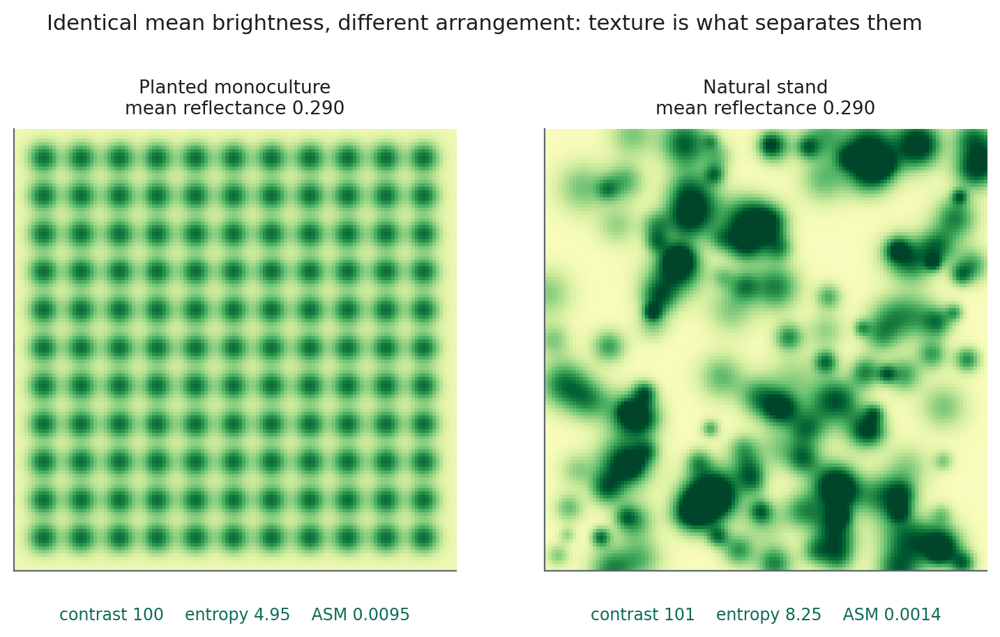

# Ekstraksi Tekstur Spasial {#sec-texture}

::: {.chapter-goal}
#### Dalam bab ini
Anda akan menambahkan pola ke spektrum. Fitur grey level co-occurrence matrix memungkinkan classifier memisahkan monokultur tanaman dari tegakan alami berstruktur rumit ketika keduanya memantulkan cahaya nyaris identik, dan itu kekeliruan yang tidak bisa diperbaiki rekayasa spektral sebanyak apa pun.
:::

## Dua hutan, satu tanda tangan

Perkebunan kelapa sawit dan tegakan mangrove alami bisa punya reflektansi rata rata yang identik di setiap band. Keduanya tajuk berdaun lebar yang rapat, keduanya berfotosintesis kuat, keduanya menyimpan air daun serupa. Indeks di Bab 12, yang semuanya fungsi dari reflektansi per piksel, tidak bisa memisahkannya karena memang tidak ada yang bisa dipisahkan di dalam reflektansi per piksel.

Yang berbeda adalah **susunannya**. Sawit ditanam pada grid teratur dengan ukuran tajuk dan jarak tanam seragam. Mangrove alami punya tajuk beragam ukuran, celah tak beraturan, alur pasang surut yang memotongnya, dan sama sekali tidak ada geometri berulang.

Penafsir manusia melihat perbedaan itu seketika, dan melakukannya tanpa mengukur satu pun nilai piksel. Analisis tekstur adalah upaya memberi classifier informasi yang sama.

## Apa yang diukur GLCM

Grey level co-occurrence matrix, diperkenalkan Haralick pada 1973 dan masih menjadi standar, bekerja pada pasangan piksel, bukan pada piksel tunggal.

Untuk suatu ketetanggaan, ia menghitung seberapa sering piksel bernilai $i$ bersebelahan dengan piksel bernilai $j$, lalu menyusun matriks dari hitungan ko-okurensi itu. Statistik yang dihitung dari matriks itulah yang menggambarkan susunan lokalnya.

Intuisinya layak dipegang. Tajuk halus dan seragam menghasilkan ko-okurensi yang mengumpul di dekat diagonal matriks, karena piksel bertetangga punya nilai mirip. Tajuk yang terputus putus dan heterogen menyebarkannya, karena tajuk terang yang tersinari sering berdampingan dengan celah gelap yang terbayangi.

## Empat ukuran yang layak disimpan

`glcmTexture()` mengembalikan delapan belas band per band masukan. Isinya sangat berulang; beberapa di antaranya nyaris duplikat. Empat membawa sebagian besar informasi yang saling bebas.

| Ukuran | Pertanyaan yang dijawabnya | Nilai tinggi berarti |
|---|---|---|
| **Contrast** | Seberapa berbeda piksel bertetangga? | Tajuk terputus dengan celah, variasi lokal tinggi |
| **Entropy** | Seberapa tidak teratur susunannya? | Regenerasi alami, tanpa pola berulang |
| **ASM** | Seberapa seragam? (kebalikan entropy) | Tajuk halus dan homogen |
| **Correlation** | Seberapa bisa ditebak sebuah piksel dari tetangganya? | Struktur periodik, misalnya barisan tanam |

**Entropy** biasanya band paling membedakan untuk pertanyaan perkebunan lawan alami, karena keteraturan justru itulah yang dipaksakan penanaman dan justru itulah yang tidak dimiliki regenerasi alami.

**Correlation** adalah yang paling sering diabaikan orang dan justru uji paling langsung untuk perkebunan, karena grid tanam benar benar periodik dengan cara yang tidak dimiliki apa pun yang alami.

{#fig-texture}

Rata rata pada @fig-texture disamakan dengan sengaja. Setiap indeks spektral yang dihitung pada kedua citra itu mengembalikan jawaban yang sama. Entropy-nya nyaris berlipat dua.

## Penyiapan yang tidak didokumentasikan siapa pun

`glcmTexture()` punya dua syarat keras dan tidak satu pun memunculkan galat yang berguna ketika dilanggar.

::: {.callout-warning}
## Kesalahan umum: memberi masukan float
GLCM memerlukan masukan **bilangan bulat**. Berikan band float dan Anda mendapat hasil ngawur, bukan sebuah exception. Karena Bab 9 sudah menskalakan reflektansi menjadi float antara 0 dan 1, bandnya harus diskalakan ulang dan dicor tipenya sebelum dipakai.
:::

::: {.callout-warning}
## Kesalahan umum: jumlah aras keabuan yang keliru
GLCM menyusun matriks $N \times N$ dengan $N$ adalah jumlah nilai berbeda.

Cor reflektansi float 0 sampai 1 langsung ke bilangan bulat dan Anda mendapat **dua** aras. Matriksnya 2 kali 2 dan tidak membawa informasi apa pun.

Kalikan 10.000 lebih dulu dan Anda mendapat ribuan aras, matriks berisi jutaan sel, dan komputasi yang menghabiskan memori.

Kuantisasi ke 0 sampai 255. Itu cukup banyak aras untuk menangkap struktur, cukup kecil untuk dihitung, dan itulah yang diasumsikan formulasi aslinya.
:::

Jalankan pada **satu band**, bukan seluruh stack. Delapan belas band keluaran per band masukan berarti sepuluh masukan menghasilkan 180 band tekstur, yang akan menghabiskan memori dan menambahkan informasi yang sebagian besar berulang, karena tekstur pada band spektral bersebelahan sangat berkorelasi.

Inframerah dekat adalah pilihan lazim untuk vegetasi, karena di situlah kontras antara tajuk tersinari dan celah terbayangi paling besar, sehingga struktur tajuk paling terlihat. Untuk pekerjaan perkotaan band tampak sering lebih baik, karena bayangan antar bangunanlah yang membawa strukturnya.

## Ukuran jendela adalah keputusan ekologis

Parameter `size` adalah jari jari dalam piksel, jadi jendela analisisnya berukuran $(2 \times size + 1)$ persegi. Pada resolusi 10 meter Sentinel-2:

| `size` | Jendela | Di tanah | Cocok untuk |
|---|---|---|---|
| 1 | 3 × 3 | 30 m | Lebih kecil dari satu tajuk besar. Mengukur derau, bukan struktur. |
| 3 | 7 × 7 | 70 m | Mencakup beberapa tajuk. Pilihan baku yang baik untuk tipe tajuk. |
| 7 | 15 × 15 | 150 m | Mencakup satu tegakan. Baik untuk tipe tutupan lahan, mengaburkan batas antar keduanya. |

Aturannya: jendela harus **cukup besar untuk memuat beberapa contoh pola** yang ingin Anda deteksi, dan **cukup kecil untuk tidak melintasi batas** antara dua tipe tutupan.

Sesuaikan dengan diameter tajuk, bukan dengan nilai baku. Tajuk mangrove berkisar 5 sampai 15 meter, jadi jendela 70 meter mencakup lima sampai empat belas tajuk, dan itu cukup untuk mencirikan susunannya tanpa merata ratakan melintasi batas.

## Alur kerja lengkap



## Uji sebelum memercayainya

Jangan menambahkan band tekstur atas dasar keyakinan. Band itu mahal, dan di sebagian bentang lahan ia tidak menyumbang apa pun.

Ujinya perlu dua menit. Cuplik band tekstur pada titik data latih Anda dari Bab 15, lalu plot dua di antaranya saling berhadapan dengan warna per kelas. Kalau dua kelas yang selama ini saling mengacaukan memisah sepanjang entropy, band itu sudah membuktikan kelayakannya. Kalau keduanya bertumpuk sepenuhnya, Anda menambahkan empat band komputasi tanpa informasi, dan sebaiknya band itu dibuang.

Ini disiplin yang sama dengan uji histogram di Bab 12, diterapkan pada keluarga fitur yang berbeda. Prinsip umumnya: setiap prediktor harus bisa membuktikan kelayakannya sebelum masuk ke stack, dan setelah masuk, grafik kepentingan fitur di Bab 16 harus memastikan ia masih menyumbang.

::: {.callout-tip}
## Dari lapangan
Perbesar ke batas antara perkebunan dan hutan alam. Pada warna sejati batas itu bisa nyaris tidak terlihat. Pada entropy ia seharusnya jelas.

Kalau ternyata tidak, ada dua kemungkinan. Ukuran jendela Anda keliru untuk ukuran tajuknya, dan itu bisa diperbaiki. Atau kedua tegakan itu memang lebih mirip daripada yang Anda kira, dan itu sendiri temuan yang layak diketahui sebelum Anda membangun classifier di atas asumsi bahwa keduanya berbeda.
:::

## Hubungannya dengan analisis berbasis objek

Bab 18 sampai ke tempat yang mirip lewat jalan yang berbeda.

Tekstur mengukur variasi di dalam jendela bergerak berukuran dan berbentuk tetap. Analisis berbasis objek menyegmentasi citra menjadi wilayah yang koheren lebih dulu, lalu mengukur variasi di dalam setiap wilayah, sehingga ia menyesuaikan diri dengan bentuk objek yang sebenarnya ada di permukaan.

Versi berbasis objek lebih berprinsip: simpangan baku yang dihitung di dalam tegakan nyata lebih bermakna daripada yang dihitung di dalam kotak 70 meter sembarang yang mungkin melintasi dua tegakan.

Tekstur lebih murah, lebih sederhana, dan bekerja sebagai band biasa dalam alur kerja berbasis piksel yang biasa. Mulailah di sini. Pindah ke Bab 18 ketika jendela tetap menjadi keterbatasannya, dan Anda akan mengenali saatnya ketika tekstur bekerja di bagian dalam tegakan dan gagal di tepinya.

## Latihan {.unnumbered}

1. Jalankan pada `size` 1, 3, dan 7 di batas perkebunan yang sama. Temukan ukuran yang membuat batasnya paling jelas dan hubungkan dengan diameter tajuknya.
2. Lewati pengecoran ke bilangan bulat lalu jalankan pada band float. Jelaskan bagaimana kegagalannya menampakkan diri.
3. Kuantisasi ke 32 aras alih alih 255. Apa yang didapat dan apa yang hilang?
4. Jalankan GLCM pada NDVI alih alih B8. Apakah sinyal strukturnya membaik, dan bisakah Anda menjelaskan mengapa?
5. Cuplik band tekstur Anda pada titik data latih lalu plot entropy terhadap contrast dengan warna per kelas. Putuskan, atas dasar bukti itu, apakah band itu dipertahankan.
