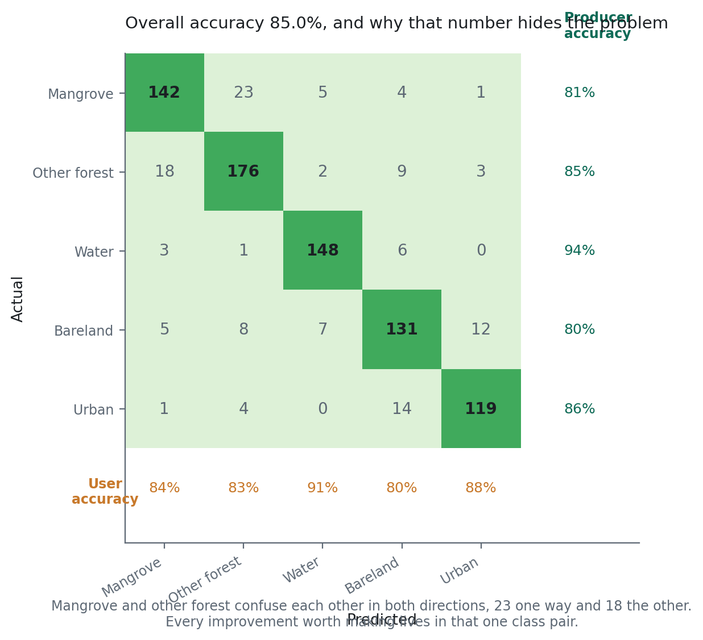

# Penilaian Akurasi {#sec-accuracy}

::: {.chapter-goal}
#### Dalam bab ini
Anda akan menyusun confusion matrix, membaca akurasi produsen dan akurasi pengguna dengan benar, memahami mengapa akurasi keseluruhan adalah angka paling tidak informatif di dalam tabel itu, lalu melaporkan estimasi luas beserta selang kepercayaan alih alih angka telanjang.
:::

## Bab yang memisahkan peta dari hasil

Siapa pun bisa menghasilkan citra terklasifikasi. Tahap yang mengubahnya menjadi sesuatu yang akan diterima penelaah, kementerian, atau verifikator karbon adalah tahap ini, dan tahap inilah yang paling sering diburu buru.

Ada alasan mengapa diburu buru. Penilaian akurasi adalah titik ketika pekerjaannya dinilai, dan angka yang jujur hampir selalu lebih rendah daripada angka yang ingin Anda laporkan. Mengerjakannya dengan benar berarti mengetahui bahwa peta Anda lebih buruk dari harapan, secara terbuka, dan tertulis.

Mengerjakannya dengan asal berarti mengetahuinya belakangan, dari orang lain.

## Confusion matrix

Klasifikasikan titik validasi yang disisihkan, lalu tabulasikan prediksi terhadap label. Baris adalah kelas aktual, kolom adalah kelas prediksi. Salah orientasi dan Anda akan menukar akurasi produsen dengan akurasi pengguna, dan itu membalik cerita yang disampaikan peta tentang dirinya sendiri.

Diagonalnya adalah kesepakatan. Semua yang di luar diagonal adalah galat, dan sel di luar diagonal itulah bagian yang paling sering dilewati orang, padahal justru bagian yang memberi tahu apa yang harus diperbaiki.

{#fig-confusion}

Akurasi keseluruhan pada @fig-confusion adalah 85 persen, yang terdengar terhormat dan nyaris tidak memberi tahu apa apa. Yang sebenarnya dinyatakan tabel itu adalah mangrove dan hutan lain saling mengacaukan di kedua arah, 23 ke satu arah dan 18 ke arah lain, sementara air praktis sudah selesai. Setiap perbaikan yang layak dikerjakan berada di dalam satu pasangan kelas itu.

## Tiga angka, tiga pertanyaan yang berbeda

**Akurasi keseluruhan** adalah proporsi titik validasi yang terklasifikasi benar. Ia satu angka yang menggambarkan persoalan banyak kelas, dan ia didominasi kelas mana pun yang luasnya paling besar. Peta yang sempurna di air dan tidak berguna di mangrove bisa melaporkan 88 persen. Kutip angkanya, dan jangan pernah berhenti di situ.

**Akurasi produsen** bertanya: dari mangrove yang benar benar ada, berapa banyak yang ditemukan peta? Kebalikannya adalah **galat omisi**, yaitu apa yang terlewat peta.

**Akurasi pengguna** bertanya: dari piksel yang disebut peta sebagai mangrove, berapa banyak yang memang mangrove? Kebalikannya adalah **galat komisi**, yaitu apa yang diada adakan peta.

::: {.callout-important}
## Integritas ilmiah: galat mana yang lebih buruk bergantung pada keputusannya
Untuk klaim karbon, **komisi** adalah arah yang berbahaya. Anda sedang dibayar untuk luas yang tidak bisa Anda buktikan keberadaannya, dan luas yang dilebihkan pada instrumen keuangan adalah paparan hukum dan finansial, bukan sekadar kekurangan teknis.

Untuk sistem peringatan deforestasi, **omisi** lebih buruk. Pembukaan lahan yang terlewat adalah pembukaan lahan yang tidak direspons siapa pun, sementara peringatan palsu hanya memakan satu perjalanan patroli.

Nyatakan arah mana yang penting untuk pemakaian Anda, lalu optimalkan dan laporkan sesuai itu. Satu angka akurasi tunggal justru menyembunyikan persis hal ini.
:::

## Kappa, dan mengapa perlu hati hati dengannya

Koefisien kappa menyesuaikan kesepakatan yang teramati terhadap kesepakatan yang diharapkan muncul karena kebetulan. Ia muncul di hampir setiap makalah penginderaan jauh selama dua dekade dan kini banyak dikritik.

Keberatan intinya, yang diajukan dengan tegas oleh Pontius dan Millones, adalah bahwa kesepakatan karena kebetulan bukan garis dasar yang bermakna untuk sebuah peta. Tidak ada yang mengklasifikasikan dengan menebak, jadi mengoreksi terhadap tebakan berarti mengoreksi terhadap sesuatu yang tidak terjadi. Kappa juga sangat peka terhadap proporsi kelas, sehingga dua peta bermutu sama di atas bentang lahan dengan proporsi kelas berbeda memperoleh kappa yang berbeda.

Laporkan kalau jurnal atau metodologi mewajibkannya. Jangan menjadikannya sorotan utama, dan jangan biarkan ia menggantikan akurasi per kelas, yang memuat informasi yang sebenarnya ingin diwakili kappa.

## Internal lawan independen

Perbedaan ini adalah inti bab ini.

**Validasi internal** memakai bagian yang disisihkan dari Bab 15. Ia menjawab pertanyaan yang sempit: apakah model menggeneralisasi ke titik yang tidak dipakai melatihnya, digambar dengan cara yang sama, oleh orang yang sama, dari citra yang sama.

**Validasi independen** memakai data yang dikumpulkan lewat proses berbeda: plot lapangan, citra resolusi tinggi yang ditafsirkan orang lain, atau produk yang sudah ada sebagai pemeriksaan silang.

Keduanya rutin berbeda lima sampai sepuluh poin, dan selisih itu bersifat diagnostik, bukan memalukan.

Selisih beberapa poin itu normal dan memang diharapkan. Selisih dua puluh poin berarti data latih Anda tidak mewakili bentang lahannya, dan penyetelan sebanyak apa pun tidak akan menutupnya, karena masalahnya ada di hulu, di Bab 15.

::: {.callout-tip}
## Dari lapangan
Belanjakan anggaran validasi lapangan Anda di tempat model model itu berselisih. Bab 16 menghasilkan layer yang menunjukkan di mana Random Forest, SVM, dan gradient boosting memberi jawaban berbeda. Mengambil titik validasi dari layer itu, alih alih secara acak, memberi tahu jauh lebih banyak per kunjungan lapangan, karena titik acak sebagian besar mendarat di tempat yang semua model sudah sepakat.
:::

## Alur kerja lengkap



## Luas bukan sekadar hitungan piksel

Menghitung piksel terklasifikasi lalu mengalikannya dengan luas piksel menghasilkan **luas peta**. Itu bukan luas populasinya, karena petanya punya galat yang diketahui dan galat itu tidak simetris: kalau komisi melampaui omisi untuk mangrove, hitungan pikselnya secara sistematis melebih lebihkan luasnya.

Koreksi praktik baik, mengikuti Olofsson dan kolega, memakai confusion matrix untuk menyesuaikan hitungannya lalu mengembalikan galat baku bersamanya. Penurunannya layak dibaca sekali. Intinya untuk buku ini singkat.

Luas yang dilaporkan sebagai **41.200 hektar** itu tidak lengkap.

Luas yang dilaporkan sebagai **41.200 hektar, selang kepercayaan 95 persen 39.600 sampai 42.800, dihitung pada skala 10 meter** itu sebuah hasil.

Versi kedua adalah yang diminta metodologi karbon, dan itulah yang membedakan pekerjaan yang diterima dari pekerjaan yang dikembalikan.

## Membandingkan dengan produk yang sudah ada

Global Mangrove Watch, ESRI Global Land Cover, dan Dynamic World meliput sebagian besar area studi, dan membandingkan terhadapnya adalah pemeriksaan kewarasan yang berguna.

Perlakukan sebagai pembanding, bukan sebagai kebenaran. Ketidaksesuaian 40 persen tidak otomatis galat Anda, dan ia tetap perlu dijelaskan sebelum diterbitkan. Alasan yang sah termasuk tahun yang berbeda, unit pemetaan minimum yang berbeda, definisi mangrove yang berbeda, dan perlakuan berbeda terhadap tegakan terdegradasi atau jarang. Peta dengan unit pemetaan minimum 10 meter akan menemukan jalur tepi yang tidak bisa dipisahkan produk 100 meter, dan ketidaksesuaian itu lalu menjadi keunggulan peta Anda, bukan cacatnya.

Yang tidak boleh Anda lakukan adalah menemukan ketidaksesuaian besar, memilih tidak menjelaskannya, lalu tetap menerbitkannya.

## Apa yang ditulis di bagian metode

Versi terpendek yang lengkap dari apa yang dihasilkan bab ini:

> Akurasi klasifikasi dinilai memakai 218 titik validasi yang disisihkan, terstratifikasi per kelas dan ditipiskan secara spasial ke jarak minimum 60 m. Akurasi keseluruhan 89,1 persen. Akurasi produsen untuk mangrove 83,5 persen dan akurasi pengguna 86,1 persen, dengan kekeliruan dominan terjadi antara mangrove dan hutan lain. Validasi independen terhadap 47 plot lapangan menghasilkan akurasi keseluruhan 84,0 persen. Luas diestimasi mengikuti Olofsson et al. (2014) pada skala 10 m, menghasilkan 41.200 ha mangrove dengan selang kepercayaan 95 persen 39.600 sampai 42.800 ha.

Setiap anak kalimat di paragraf itu adalah keputusan yang diminta bab ini dan Bab 15 untuk Anda ambil secara sadar. Itulah tujuan kedua bab tersebut.

## Latihan {.unnumbered}

1. Temukan sel di luar diagonal yang terbesar di matriks Anda. Sebutkan kedua kelasnya lalu usulkan satu prediktor yang memisahkan keduanya secara fisik, bukan secara statistik.
2. Laporkan akurasi internal dan independen berdampingan. Kalau selisihnya melampaui sepuluh poin, tulis satu paragraf tentang apa dalam data latih Anda yang menyebabkannya.
3. Tumpangkan peta Anda dan Global Mangrove Watch. Pilih tiga area yang berselisih lalu tentukan dari citra resolusi tinggi mana yang benar.
4. Hitung luas pada 10 m dan pada 100 m lalu laporkan keduanya dengan skala yang disebutkan. Jelaskan kepada orang non spesialis mengapa keduanya benar.
5. Tulis paragraf metode untuk peta Anda sendiri mengikuti templat di atas. Kalau ada anak kalimat yang tidak bisa Anda isi, Anda baru saja menemukan keputusan yang Anda ambil tanpa sengaja.
